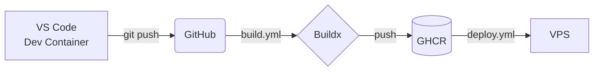

# CLAUDE.md — Repository instructions for Claude (and humans)

> This is a personal how-to reference library. Every document in this repo follows a specific style: **opinionated, alternatives-aware, historically grounded, and example-heavy.** This file documents that style, indexes every existing how-to with deep context, and provides a template for adding new ones.
>
> Read this file in full before editing anything in this repo or writing a new how-to.

---

## What this repo is for

A personal collection of "how to do X" tutorials I (Joshua Julian) have written for my own future reference, with enough context that:

- **Six months from now**, when I've forgotten why I made a particular choice, the doc explains it.
- **An AI agent** opening this repo can extend, correct, or update any how-to without breaking the style or principles.
- **Someone else reading it** (collaborator, friend, eventual public release) can follow it without prior context about my preferences.

The repo is not a "list of commands to copy-paste." It's a **decision record + tutorial hybrid** — the kind of doc where you can read the surrounding prose and understand why each command is what it is, what could have been done instead, and what would go wrong if you skip a step.

## About the author (calibration for tone and depth)

Joshua Julian. Brief profile because it changes how docs in this repo should be written:

- **Computer science undergrad.** Foundational CS concepts — type systems, complexity, data structures, the Unix mental model, distributed-systems vocabulary — don't need to be re-explained. Use the right names for things; don't analogize.
- **Hobbyist coder for life.** I've been writing code since before undergrad. I'm not new to programming. I'm new to *specific tools*. Explain `uv` (it's recent, niche-but-spreading); don't explain what a package manager is.
- **Active-duty Army aviator. 19 years flying.** Two consequences for how docs read:
  1. I think in checklists and procedures. Aviation does that to you. Expect step-by-step structures, "before you commit, verify…" sections, and a strong preference for "do these things in this order" over "explore freely." The how-tos should match that brain.
  2. I'm not a full-time engineer. I code daily but I'm not on Hacker News at lunch tracking the latest framework drama. Treat me as a smart engineer who isn't current on JS framework churn or the npm crisis-of-the-week. Foundational stays implicit; novel tools get a paragraph of context.
- **MSDS in progress** (Master's in Data Science, UT Austin). Stats, ML, scientific computing, and Python data tooling are fair game — don't water them down. Future how-tos in this repo will likely include data-science topics (Polars vs pandas, GPU setup, Jupyter workflows, MLOps).
- **Time is the scarcest resource.** Full-time job + family + master's program + side-project coding adds up to *very* little deep-work time. The whole reason for writing these how-tos is so future-me doesn't have to re-figure out what present-me just figured out. Front-load explanation. Minimize "you'll figure it out" moments. Every "see the docs" link without a summary is a future me spending 20 minutes re-finding the answer.

### What this means for writing style

- **No condescension.** Don't say "as you may know" or "in software engineering, we…" — just say the thing.
- **Don't over-analogize.** "It's like a kitchen pantry but for code" is for somebody else's docs.
- **Use the precise technical term.** Don't say "the thing that does X" when there's a name for the thing.
- **Aviation analogies are welcome** when they actually clarify (checklists, go/no-go decisions, mission planning, after-action review). Don't force them.

## Layout

```
howtos/
├── CLAUDE.md                         # this file
├── README.md                         # short index for humans browsing the repo
├── vps-from-zero/
│   └── README.md                     # provisioning a fresh Ubuntu VPS
└── dockerized-deployments/
    └── README.md                     # CI/CD pipeline + dev containers
```

Each how-to lives in its own subdirectory. The main content is always `README.md` inside that directory, because that's what GitHub and VS Code render by default. Additional assets (diagrams, helper scripts, example configs) live in the same directory.

---

## Writing standards

Every how-to in this repo must satisfy **seven standards**. These aren't suggestions; they're load-bearing. If a how-to lacks one, it's incomplete.

### 1. Opinionated

The doc takes a stance. It doesn't say "you could use Docker, or Kubernetes, or systemd, or…" — it says "use Docker for these reasons, and here's when to reconsider."

**Why:** Lists of options without recommendations are useless to a future me trying to make a decision quickly. Wishy-washy "it depends" advice is what you get from search-engine-optimized content farms. The whole point of writing my own how-to is that I have a defensible position; the doc should preserve that position so I don't relitigate it every time.

**How to apply:**

- State the recommended path early and clearly.
- Use phrases like "use X" not "X is one option."
- When something is a judgment call, say it's a judgment call and *still pick a side*.
- Defend the recommendation with concrete reasons.

**Example of opinionated writing** (from `dockerized-deployments/README.md`):

> **`workflow_run` trigger explained**
>
> Splitting build from deploy means:
>
> - A failed build never produces a deploy.
> - You can see the build/deploy status separately on the Actions tab.
> - You can re-deploy without re-building (just trigger deploy.yml manually).
> - The deploy can be disabled temporarily without breaking the build.
>
> **Alternative pattern**: a single workflow with two jobs, where deploy `needs: build`. That works too — slightly faster, one less workflow file. Two workflows is slightly cleaner for log reading.

Note the doc picks "two workflows" *and* acknowledges the alternative *and* says why it picked one over the other. That's the formula.

**Anti-pattern (don't do this):**

> You can split build and deploy into two workflows or one workflow with multiple jobs. Both have tradeoffs.

That's evasive. The reader has no idea what to do.

### 2. Alternatives-aware

For every meaningful choice, the doc lists the alternatives — what else could have been done — and explains *when to reconsider*.

**Why:** Conditions change. The "right" choice for a personal VPS with one developer isn't the right choice for a 50-person team with HA requirements. Documenting alternatives keeps the doc useful as conditions evolve, instead of becoming dogma that no longer fits.

**How to apply:**

- Include an "Alternatives considered" section near the end (or per major decision).
- For each alternative, say *when to reconsider it* — what change in conditions would tip the balance.
- Use a comparison table when there are 3+ alternatives.

**Example** (from `vps-from-zero/README.md`):

> | Pattern | Verdict | Why |
> |---|---|---|
> | **Fly.io / Railway / Render** | Use these if you want zero-ops. Free tiers are tight. | Best simplicity; monthly costs scale per-app. |
> | **Kubernetes (k3s, k0s)** | Overkill for a personal VPS. | The complexity tax isn't justified until you have ≥5 nodes or genuine HA needs. |
> | **This guide** | The sweet spot for 1–10 apps on one box. | Add one app at a time without disturbing others; same workflow scales. |

Note the "verdict" column is opinionated AND each row has a reconsider condition implicit in the "why."

### 3. Historically grounded

The doc explains *why this approach exists* — what problem it solves, what didn't work before, what historical accident led to this being the right way to do it.

**Why:** Knowing why something is a certain way is often the difference between maintaining it correctly and breaking it. Cargo-cult solutions ("we do X because everyone does X") don't survive the first time you have to debug them.

**How to apply:**

- When introducing a tool/technique, briefly explain what it replaced or what gap it filled.
- When showing a config that's idiomatic, explain *why* it became idiomatic.
- Reference real incidents or pain points that motivated the design.
- When something looks weird (a flag, an order of operations), explain the history.

**Example** (from `dockerized-deployments/README.md`):

> **`COPY pyproject.toml uv.lock ./` and `RUN uv sync --frozen --no-install-project --no-dev`**
>
> This is the **layer-caching trick** that makes builds fast.
>
> Docker caches each `RUN` step's resulting filesystem. If the inputs haven't changed (file contents, command), Docker reuses the cached layer. By copying *only the dependency manifest* and running install before copying the actual source code, we ensure that:
>
> - Code changes (which happen many times per day) don't invalidate the dep-install layer.
> - Dep changes (which happen occasionally) do invalidate it — correctly.

The "trick" framing is historical — this is a pattern people figured out by suffering through 10-minute builds and then noticing the layer cache was being invalidated too often. Mentioning that history lets the reader appreciate *why* this seemingly arbitrary order matters.

**Another example** (also from dockerized-deployments):

> **Security caveat about the docker group.** Anyone in the docker group can mount the host filesystem into a privileged container and effectively become root. This is a known property of Docker, not a bug.

Calling it "a known property, not a bug" is doing historical/cultural work — it tells the reader that this isn't something that's going to be "fixed," it's by design, and there are mitigations rather than workarounds.

### 4. Example-heavy

Every concept must be paired with **at least one concrete example**. Many concepts get multiple examples — including failure modes and counter-examples ("what NOT to do").

**Why:** Abstract explanations slide off the brain. Concrete examples stick. "Many examples" is better than "the right example" — when you give five examples, the reader builds intuition; with one, they memorize.

**How to apply:**

- Every command shown should have a sample of what good output looks like (or what the failure looks like).
- Every config field should have a value example, not just a description.
- Every decision should have a real-world scenario where the decision matters.
- Show what to do AND show what to NOT do, side by side.

**Example** (from `dockerized-deployments/README.md`):

> ### Why each piece is the way it is
>
> **`image: postgres:16`**
> Pin a specific major version. **`:latest` is dangerous here** — Postgres major versions are not data-file-compatible. If a `docker compose pull` upgrades you from 16 to 17 across a reboot, the new container will fail to start because the data files are in the 16 format.

That's the principle stated + the failure mode shown concretely. Reader doesn't just learn "pin major versions" abstractly; they learn what would actually break and how.

**Another example** (table from migration troubleshooting in dockerized-deployments):

> **Migration partially applied (e.g., ADD COLUMN succeeded but UPDATE failed):**
>
> - Schema is mid-state. Bot still on old image, but schema isn't where Alembic thinks it should be.
> - Either push a corrective migration, or manually fix the DB:
>   ```bash
>   docker exec -it infra-postgres-1 psql -U botuser -d botdb
>   -- apply the operations Alembic didn't finish
>   -- update Alembic's bookkeeping
>   UPDATE alembic_version SET version_num = '<the-revision-id>';
>   ```
>   Take a backup first.

Concrete failure → concrete recovery commands → caveat. Not "you might need to fix it manually"; *here is the SQL you might run.*

### 5. Future-proofed (bleeding edge)

The doc recommends and uses **the latest stable versions of every tool referenced**, and uses the most modern syntax/features available. Older versions appear only in the "Alternatives considered" treatment with explicit reasons to reconsider them (compatibility, organizational constraints, etc.).

**Why:** Personal how-tos that lock you into two-year-old tool versions become net-negative — you read them in 18 months and they're recommending workflows that have been superseded by something faster, simpler, or better-supported. Bleeding edge ages out *faster* than conservative tooling, but it ages out *cleanly*: you can tell from version numbers and feature mentions that an update is overdue. Conservative version pinning ages out *invisibly* — the doc keeps "working" while the world moves past it, and you don't notice until you're three years behind.

Future-proofing also means **automating the things that move**. Pin to specific versions (for reproducibility), but pin to the *latest at time of writing*. Use action versions that auto-update minor revisions (`actions/checkout@v4`, not `actions/checkout@v4.1.7`). Use `:16` for Postgres major-version pinning, not `:16.4.2`. The goal is "still works in a year with minimal upkeep," not "frozen in time."

**How to apply:**

- Pick the **latest stable major version** of every tool referenced. As of writing: Python 3.12+, Postgres 16+, Ubuntu 24.04+, Docker Engine current, Compose v2.22+, GHA action `@v4` / `@v5` (current majors).
- Use **modern syntax** wherever available — modern Python (`match` statements, `|` type unions), modern Compose (`develop.watch.sync`), modern Docker (BuildKit / Buildx features), modern shell (`#!/usr/bin/env bash` not `#!/bin/sh`).
- Use **modern tools** where they've clearly won — `uv` over `pip+venv+pip-tools`, `ruff` over `flake8+isort+black`, `pnpm` over `npm` (or `bun` if that's stabilized by the time you're reading this), `pydantic v2` over `dataclasses` for serialization, etc.
- **Note "as of <month> <year>"** near version specifics so a future reader knows roughly when the doc was last validated.
- When BleedingEdge has a known cost (e.g., a tool's API is still stabilizing), call it out explicitly in the doc and pick the cost honestly.

**Example** — from `dockerized-deployments/README.md`:

- Uses `uv` (rapid adoption since 2024) instead of pip+poetry.
- Uses Python 3.12-slim base image.
- Uses BuildKit via `docker/setup-buildx-action@v3`.
- Uses Compose `develop.watch.sync` (requires Compose v2.22+).
- Uses GHA `actions/checkout@v4`, `docker/build-push-action@v5`, `docker/metadata-action@v5` — latest stable majors.

**Anti-pattern:** A doc that still recommends `virtualenv + pip-tools + requirements.txt` (the 2019 stack) when `uv` does the whole job in one binary that's 100× faster.

**Anti-pattern:** Using `docker-compose` (the legacy Python-based v1 binary) instead of `docker compose` (the Go-based v2 plugin). v1 has been EOL since 2023; v2 is the only thing that gets new features.

**Maintenance discipline:** Once a year, sweep every how-to and bump version numbers / replace tools that have been superseded. Note the bump date in commits.

### 6. Automation-first

The doc treats manual procedures as a **last resort**. Where automation exists — CI/CD pipelines, declarative configs, shell scripts, cron, systemd units — the doc shows the automated path as the canonical one. Manual recipes appear only when:

- Automation is genuinely impossible (one-time provisioning of a fresh box; interactive auth flows; irreversible decisions a human must confirm).
- The reader needs to understand the manual flow in order to debug the automated one (e.g., the `docker compose run --rm migrate` command you'd run by hand to investigate a failed CI migration).

**Why:** Manual steps are where mistakes hide. "Now SSH in and run X" is a great way to forget to run X, or to run it on the wrong server, or to skip it because you remember "doing it last time" (but on a different machine, or a different version, and now your context is wrong). Automation pushes the *opportunity for mistakes* to the **design layer**, where it gets debugged once and then keeps not failing. Manual procedures push it to **every execution**, where it has to be re-debugged forever.

Automation is also how the doc stays useful as the writer gets older / has less time. A how-to that needs you to remember 12 steps is a how-to that won't be used in two years. A how-to that ends with "and now `git push` does the rest" is the kind that pays compounding dividends.

**How to apply:**

- For **deploys**, show the CI/CD pipeline as the only canonical path. Manual SSH-and-restart appears only in the rollback section or in troubleshooting.
- For **repeated procedures**, write a shell script in `scripts/` rather than listing the steps in prose. Reference the script from the doc.
- For **scheduled tasks**, write a cron entry or systemd timer; document that.
- For **secrets / configuration**, use declarative files (`.env`, compose `env_file:`) — not "now export these variables manually."
- When a manual step is *genuinely* required, **explicitly explain why automation doesn't apply** ("this is one-time provisioning of a fresh VPS, so there's nothing to automate it from yet").
- When showing a manual command, **also show what automating that command would look like** ("the same thing in a cron entry: …").

**Example** — from `dockerized-deployments/README.md`:

- The entire end-to-end CI/CD pipeline (build → push → SSH → pull → migrate → restart) replaces what would otherwise be ~8 manual SSH steps per deploy.
- The migrate service is a compose-defined automation invoked by the deploy script — *not* "remember to run `alembic upgrade head` after deploying."
- Image tagging (`:latest` + `:sha-<commit>`) is computed by `docker/metadata-action@v5` rather than the developer writing tag arguments by hand.

**Example** — from `vps-from-zero/README.md`:

- `unattended-upgrades` automates security patching. No "remember to run `apt upgrade` weekly."
- The `pg_dumpall` backup script is invoked from cron, not "remember to run it."
- The deploy user is created with `--disabled-password` so password rotation isn't a thing you need to remember to do.

**Anti-pattern:** A doc whose "deploy" instructions are "SSH in, `cd ~/app`, `git pull`, `pip install -r requirements.txt`, `alembic upgrade head`, `systemctl restart app`, watch logs." Every one of those steps is a future failure. The whole sequence should be a CI workflow with one trigger: `git push`.

**Anti-pattern:** A doc that says "you'll want to set up backups eventually" but doesn't show the script and cron entry that *actually does the backups*. "Eventually" means "never."

**Where manual is correct:**

- The first ~30 minutes of provisioning a brand-new VPS — nothing to automate it *from* yet. (Though even there, prefer a single bootstrap script the user runs once.)
- Decisions that require human judgment (e.g., which Discord token to use, which domain name to attach).
- Irreversible operations where a wrong automated step is worse than a wrong manual one (e.g., DROP TABLE in prod).

### 7. GitHub-renderable (rich GFM)

The doc renders correctly **on GitHub** when pushed to this repo — because that's where I actually read it. The doc uses **GitHub-Flavored Markdown (GFM)** features wherever they materially improve clarity over plain Markdown.

**Why:** I read these docs from my phone, my browser at work, my IDE, sometimes from someone else's computer. GitHub is the lowest common denominator and the place where the rendered version lives. Anything that doesn't render there is invisible to me at the moment I most need the doc. Within the GFM constraint, *using* the modern features — math, diagrams, admonitions, collapsible sections — is what makes a long doc actually scannable on a 6-inch phone screen at 11pm.

**How to apply** — the GFM feature inventory, as of 2026-05-26:

**Baseline (always fair game):**

- Tables with alignment.
- Task lists (`- [ ]` and `- [x]`) — great for verification checklists.
- Fenced code blocks with language tags (always specify a language for syntax highlighting).
- Footnotes for tangential asides[^1].
- Autolinking — plain `https://...` URLs become links.
- Strikethrough (`~~text~~`).
- Headers up to 6 deep (don't go past 4 in practice).

[^1]: like this one — used for context that would interrupt flow if inlined.

**Admonitions** (GitHub added support in late 2023). Five flavors:

```markdown
> [!NOTE]
> Useful non-obvious context.

> [!TIP]
> Helpful advice that's not strictly necessary.

> [!IMPORTANT]
> Crucial information necessary for the reader to succeed.

> [!WARNING]
> Content demanding immediate attention. Can break things.

> [!CAUTION]
> Negative consequences of an action — use for "don't do this."
```

Use sparingly. `[!WARNING]` for things that can break prod. `[!NOTE]` for important non-obvious context. Overuse dilutes the signal — three callouts on one page is fine; ten is shouting.

**Math via LaTeX** (GitHub added in mid-2022). Inline math with `$...$`:

```markdown
The complexity is $O(n \log n)$.
```

Block math with `$$...$$`:

```markdown
$$
\int_0^\infty e^{-x^2} dx = \frac{\sqrt{\pi}}{2}
$$
```

Use when explaining algorithms, statistics, performance characteristics, or anything where the math is genuinely clearer than prose. Don't use math just to look academic — equations should clarify something the prose can't.

**Mermaid diagrams** (GitHub added in 2022). Replaces ASCII art for non-trivial diagrams:

````markdown

````

Renders as actual SVG on GitHub; ASCII art is just monospace text by comparison.

Use Mermaid for:
- Architecture diagrams (`graph LR` / `graph TD`)
- Sequence diagrams (`sequenceDiagram`)
- State machines (`stateDiagram-v2`)
- Decision trees / flow charts
- Gantt charts (rare)

Don't use Mermaid for:
- Simple linear lists (a bulleted list is clearer)
- Diagrams with more than ~10 nodes (gets messy)
- Anything that's already a clean table

**Collapsible sections** via `<details>` / `<summary>`:

```markdown
<details>
<summary>Full Dockerfile (click to expand)</summary>

```dockerfile
FROM python:3.12-slim AS base
... 80 lines ...
```
</details>
```

Use for:
- Full config dumps that are reference-but-not-prose.
- Long stack traces in troubleshooting.
- Optional appendix material.
- Alternative versions ("show me the Node.js equivalent" etc.).

Don't use to hide content that's part of the main reading flow.

**Emoji shortcodes** — sparingly. `:rocket:` → 🚀, `:warning:` → ⚠️, `:white_check_mark:` → ✅. Useful as status indicators in tables. Don't pepper prose.

**Status badges via shields.io** — for repo-level READMEs (less relevant for individual how-tos), e.g. ``.

**Anti-patterns:**

- **Don't use custom HTML / CSS.** GitHub sanitizes most of it. `<div class="...">` and inline styles get stripped. Anything you want to render reliably must be expressible in markdown or GFM extensions.
- **Don't use Pandoc-only or non-GFM extensions** like `{: .class}` attribute blocks, `[[wikilinks]]`, or `:::admonition` fences. They render as literal text on GitHub.
- **Don't write ASCII art when Mermaid would do.** ASCII renders in plaintext but loses badly to Mermaid's clarity on GitHub.
- **Don't nest admonitions** or stack `[!WARNING]` callouts back to back — they stop being warnings.
- **Don't use math purely for aesthetics.** It should explain something. A page of unmotivated LaTeX is worse than a paragraph of clear prose.

**Maintenance discipline:** Check the [GFM feature list](https://docs.github.com/en/get-started/writing-on-github) once a year. New features arrive regularly — math in 2022, Mermaid in 2022, admonitions in 2023. When something useful lands, update this standard.

**Spot-check before pushing:** Open the rendered markdown on github.com after pushing. Look at it on a phone if possible. If a section doesn't render the way you intended, that's the bug — fix the markdown, not the renderer.

---

## Default tech stack

These are the **preferred tools and frameworks** for new how-tos and the projects they cover. They're **defaults**, not mandates — when a specific how-to has a real reason to deviate, that's fine, but explain the deviation in that doc rather than pretending the default doesn't exist.

This section exists to keep the repo's recommendations *coherent*. If one how-to recommends Postgres + SvelteKit + Bun and another recommends MongoDB + Next.js + Node, the reader can't reuse infrastructure between projects. The defaults ensure each new project plugs into the same stack.

### Languages and runtimes

| Domain | Default | Notes |
|---|---|---|
| Web apps, CLIs, scripts in JS land | **TypeScript** | Always. Even for 50-line scripts. The editor experience pays for itself. |
| JavaScript runtime | **Bun** | Fast (5-10× Node), single binary, native TypeScript, pleasant DX. Falls back to Node+pnpm only when a specific dependency doesn't work on Bun. |
| Data / ML / scripting / scientific | **Python 3.12+** | With **`uv`** as the universal tool (package management, venv, running, building). Never `pip+venv+pip-tools`. |
| Performance-critical services / CLIs | **Go** | When a CLI needs to ship as a single binary, or a service needs latency Go gives you. |
| Anything systems-level | **Rust** | When the safety guarantees matter. |

### Web frameworks

| Use case | Default |
|---|---|
| Full-stack web app (SSR + client) | **SvelteKit** |
| Pure SPA or embeddable widget | **Svelte** (without Kit) |
| Marketing site / docs | **SvelteKit static adapter**, or a static-site generator if SvelteKit is overkill |

> [!NOTE]
> Prefer SvelteKit's built-in primitives over adding libraries — form actions, load functions, hooks, the file-based router. Reach for a library only when the built-in primitive genuinely doesn't cover the case.

Avoid React / Next / Vue / Nuxt for *new* projects covered by how-tos here, unless:

- The project must integrate with an existing React ecosystem.
- A specific library you need exists only in React.
- $WORK uses it and the how-to is documenting how to maintain that codebase.

### Databases

| Use case | Default |
|---|---|
| Relational data, production | **Postgres** (latest stable major, pinned in compose) |
| Local-only / ephemeral | **SQLite** is fine for development; Postgres for anything that crosses environments |
| Caching / ephemeral key-value | **Redis** when caching is genuinely needed; otherwise just use Postgres |
| Full-text search | Postgres `pg_trgm` and `tsvector` first; reach for OpenSearch/Meilisearch only at scale |
| Time-series | Postgres + TimescaleDB extension as default; specialized stores only if necessary |

Avoid MySQL, MariaDB, MongoDB, DynamoDB for new how-tos unless the use case specifically demands them.

### Infrastructure / hosting

| Use case | Default |
|---|---|
| Personal hosting | A VPS provisioned per [vps-from-zero](./vps-from-zero/README.md). |
| CI/CD | GitHub Actions. |
| Container registry | GHCR. |
| Reverse proxy | Caddy. |
| Container orchestration | Docker Compose. K8s is explicitly out unless ≥3 nodes. |

### Editor and local dev environment

| Tool | Default |
|---|---|
| Editor | **VS Code**, always. |
| Local dev environment | **VS Code Dev Containers + Docker** for any non-trivial project. Single-file scripts can live in WSL directly without a container. |
| Container engine | **Docker Engine** — Docker Desktop's WSL integration if it's set up, or `docker.io` installed directly in the WSL distro. |
| Terminal | Default WSL Ubuntu bash; `tmux` only when running multi-pane work. |
| Shell prompt | Default bash; not a styled prompt theme. |
| Operating system (laptop) | **Windows 11 + WSL2** (Ubuntu 24.04). All development work happens inside WSL, never in Windows directly. |

> [!NOTE]
> Open to alternatives to Docker (Podman, especially) when a specific case calls for it. Dev Containers themselves are the principle — the implementation can vary. But the default for now is Docker, and a how-to that recommends something else should say *why* in that doc.

Why Dev Containers as the default:

- **Same environment for every project.** No more "wait, which Python version does this repo want?" The container has the answer.
- **Same environment for every developer / device.** When a friend opens the repo, they get the same toolchain in one command (`Reopen in Container`).
- **Same environment as production.** The container that runs CI tests is the container you're typing in. Eliminates "works on my machine."
- **Cleanup is free.** Throw away the container; the host stays clean. No "is this venv still important?"

The cost — one-time container build at ~30-90 seconds, and a bit of mental overhead about inside-vs-outside — is paid back the first time you avoid a "wrong Python version" debug session.

### Why these defaults

- **TypeScript**: type safety pays compounding dividends as a codebase grows. Even for a tiny script, the editor experience (autocomplete, refactoring, jump-to-definition) is meaningfully better. The cost (a tsconfig and a build step) is one-time.
- **Bun**: as of 2026, it's measurably faster than Node for nearly every operation (`bun install`, `bun test`, `bun run`), supports TypeScript natively without a build step in dev, ships as a single binary, and has the cleanest API for shell scripting in JS. The DX gap over Node has stopped being subtle.
- **Svelte / SvelteKit**: smaller bundles, less boilerplate, and faster runtime than the React family. Reactivity is part of the language (`$state`, `$derived` in Svelte 5), not a hook system grafted on top. The framework gets out of the way.
- **Postgres**: most mature open-source database, every feature you'd reach for (JSON, full-text search, geo, recursive CTEs, materialized views, logical replication), permissive license, predictable behavior. The only database I trust to not lose data.

### When to deviate

The defaults aren't mandates. Deviate when:

- **The integration point requires a specific stack.** Contributing to a React project means writing React.
- **A specific feature only exists in another tool.** ClickHouse for OLAP, Redis for pub/sub, etc.
- **An existing codebase already uses something else** and the how-to is documenting how to work with it.
- **A new tool has clearly surpassed the default.** When that happens, update this section *first*, then write the how-to.

When deviating in a how-to, **explain why in one paragraph** within that doc. Don't write a SvelteKit-killer alternative without acknowledging the default and explaining why this specific case calls for the deviation.

### Maintenance discipline

Defaults rot. Once a year, sweep this section and verify each pick is still the right one. Bun, in particular, is on a fast trajectory — if it has settled (or been overtaken), update accordingly.

---

## What's in this repo

Thirteen how-tos as of writing. Each gets its own deep entry below.

### 1. `vps-from-zero/`

**Path:** [vps-from-zero/README.md](./vps-from-zero/README.md)

**What it covers**

Taking a brand-new Ubuntu VPS from "the provider just emailed you root credentials" to "locked-down server with Docker, a shared Postgres, and a clean directory layout, ready to host containerized apps." The boundary is intentional: this doc handles **infrastructure**, not applications.

**Who it's for**

Me, when I rebuild this stack on a new VPS. Or anyone who:

- Has paid for a $5/month Hetzner / DO / Linode box.
- Is comfortable on a Linux command line but isn't a sysadmin.
- Wants to host their own side projects without leaning on a PaaS.

**Historical context — why this how-to exists**

Every time I've gotten a new VPS, I've spent half an hour re-googling "how do I disable root SSH login" and "what's the safest way to install Docker on Ubuntu." Each time I'd skip something — install Docker via apt (which gets you a Docker that's 6 months old), forget to set up unattended security updates, leave Postgres on `0.0.0.0:5432` because the default tutorial didn't warn against it. The how-to is what I wish I'd had: a single document that gets every important step right and explains why each one matters.

The structure (admin user + separate deploy user + per-app DB users) emerged from years of mixing personal and CI access on the same account and getting nervous about blast radius. Once I split them, "what if my CI key leaks" stopped being an existential question.

**Opinionated stance**

This document believes:

- **Keys not passwords**, full stop, day one. Password auth on the public internet is brute-forced in minutes.
- **Default-deny firewall.** UFW with only OpenSSH allowed. Add 80/443 only when there's a service to expose.
- **Three layers of identity** (admin user, deploy user, DB-user-per-app) is the right granularity for a personal VPS. More layers is overkill; fewer is risk.
- **Pin Postgres major versions.** `:latest` is a footgun; Postgres major upgrades require explicit dump/restore.
- **Patch automatically.** `unattended-upgrades` on day one. Unpatched OpenSSH is the #1 reason personal VPSes get owned.
- **Use the official Docker install script**, not `apt install docker.io`. The Ubuntu repo lags by months.

**Alternatives considered (with reconsider conditions)**

The doc has a full "Alternatives considered" section. Highlights:

- **Fly.io / Railway / Render** — recommended if you only have 1-2 apps and don't want to learn ops. Reconsider this VPS approach if monthly hosting costs are negligible relative to your time.
- **Kubernetes (k3s on a single node)** — actively rejected. Complexity tax not justified for one box. Reconsider when you have ≥3 nodes or true HA needs.
- **Coolify / Dokploy / CapRover** — actively rejected for *this* doc, because they hide the compose layer and break the "you can debug it" property. Reconsider when you have 5+ apps and the GUI ergonomics outweigh the abstraction tax.

**Concrete examples in the doc**

- A complete sshd_config lockdown (what to set, why each setting matters, what the failure mode is if you skip it).
- A real `pg_dumpall` backup script with retention.
- The `\du+ <user>` and `\l+ <db>` audit commands with example output.
- A "before closing your session, open a new terminal and confirm SSH still works" safety check — born from getting locked out of a VPS once.

**What's NOT in this doc**

- How to deploy apps. That's the dockerized-deployments doc.
- How to set up monitoring/alerting. Mentioned as "next steps," not covered.
- HA / multi-VPS setups. Explicitly out of scope.
- Anything Windows-server related.

---

### 2. `dockerized-deployments/`

**Path:** [dockerized-deployments/README.md](./dockerized-deployments/README.md)

**What it covers**

The end-to-end automation that takes code from "I'm typing in a VS Code Dev Container" to "running on the VPS, automatically, on every push to main." Covers:

- Multi-stage Dockerfile (one image, dev + prod stages)
- VS Code Dev Containers as the local dev environment
- GitHub Actions building and pushing to GHCR
- SSH-based CD to the VPS
- Database migrations integrated into the deploy pipeline
- Multi-app architecture (adding the Nth app at zero marginal cost)
- Caddy reverse proxy for web apps
- Rollbacks

**Who it's for**

Me, every time I start a new side project. Or anyone who:

- Has finished `vps-from-zero` (or has an equivalent VPS setup).
- Wants the full CI/CD pipeline, not just "Dockerfile basics."
- Is willing to spend 30 minutes on the first project's plumbing to get a workflow that scales to N projects.

**Historical context — why this how-to exists**

For years I'd deploy side projects by SSHing into a VPS, running `git pull && systemctl restart`, and crossing my fingers. Three problems with that:

1. **Dev/prod drift.** "Works on my Mac, breaks on the Linux VPS." Python version mismatch, missing apt package, libssl version skew — each one a half-hour debugging session.
2. **Migration nightmares.** "Did I run the migration before restarting? Should I have? Is the schema where I think it is?" — answered by SSHing in, running psql, hoping.
3. **Per-app drudgery.** Setting up systemd units, nginx config, venv path quirks — each new project was a fresh adventure in remembering how to set up the boring parts.

Dockerization fixed (1). CI/CD fixed (3). The migration-as-a-compose-service-with-profiles pattern fixed (2). The doc captures all three insights and the wiring that ties them together.

The dev container piece came later, after the n-th time I had to install the same `apt install postgresql-client libpq-dev` on a new laptop. Now my "laptop" is a Linux container that lives in the repo.

**Opinionated stance**

This document believes:

- **One image, many environments.** Same artifact in dev container, in CI tests, on the VPS. Configuration via env vars; never bake env-specific stuff into the image.
- **Stacks, not monoliths.** One docker-compose per app. Shared services in their own stack. Restarting one app must not touch the others.
- **CI builds, CD deploys.** Two separate workflows. The boundary is the image in GHCR. Each phase is independently debuggable.
- **Multi-stage Dockerfile** is mandatory. Single-stage means dev tools ship to prod, which means bloat and attack surface.
- **Pin runtime versions** (Python, Node, Postgres clients) in the Dockerfile. Don't trust "latest stable" to mean the same thing in 6 months.
- **Migrations as a separate compose service with `profiles:`.** Run explicitly via `compose run --rm migrate` in the deploy pipeline, before the app restart. Never bake migration into the app's startup.
- **Tag every CI build with both `:latest` and `:sha-<commit>`.** SHA tags are immutable; they're your rollback handle.
- **Caddy for HTTPS.** Three lines of config; Let's Encrypt auto-renewal; done.

**Alternatives considered (with reconsider conditions)**

Per major decision:

- **Registry: GHCR vs Docker Hub vs self-hosted.** Pick GHCR. Reconsider Docker Hub if you specifically want anonymous-pullable public images with a known reputation. Reconsider self-hosted only if you're operating at scale where the bandwidth/storage matters.
- **CI: GitHub Actions vs GitLab CI vs Jenkins/Drone.** Pick GHA. Reconsider if you're on GitLab anyway, or if you have organizational compliance requirements that need self-hosted.
- **Dev env: Dev Containers vs local venv vs Nix.** Pick Dev Containers for the dev/prod identity property. Reconsider local venv for ultra-fast iteration on a single language. Reconsider Nix if you want reproducibility without containers.
- **Migrations: Alembic vs Yoyo vs Flyway vs raw SQL.** Pick Alembic for Python/SQLAlchemy. Reconsider Yoyo if you're not using SQLAlchemy. Reconsider Flyway only if you're in a Java shop.
- **Reverse proxy: Caddy vs Traefik vs nginx.** Pick Caddy for the config simplicity. Reconsider Traefik if you want Docker labels driving config. Reconsider nginx if you have an existing nginx config investment.

**Concrete examples in the doc**

This is where the example-heavy standard is most heavily applied:

- The full Dockerfile, line-by-line annotated with what each directive does and why.
- The full devcontainer.json, field-by-field explanation including what would happen without each field.
- The full build.yml workflow, block-by-block.
- The complete deploy.yml workflow, including the `workflow_run` trigger semantics.
- A full end-to-end walkthrough of a single feature (new `/leaderboard` command + scores table) from "branch off main" through "verify in production," with timing.
- Database migration setup with Alembic — wiring `env.py` to read `DATABASE_URL` from env, the migrate service in compose, the deploy pipeline integration, and three concrete failure modes (clean failure, partial application, schema-rolled-back-but-image-not).
- The expand/contract migration pattern with concrete SQL operations across multiple deploys.
- A troubleshooting table mapping symptom → layer to debug.
- A rollback workflow with a real example command.

**What's NOT in this doc**

- How to provision the VPS in the first place. That's vps-from-zero.
- How to write good application code, write tests, etc. — language-specific.
- Multi-VPS / load-balancer / blue-green deploys. Out of scope for the "personal box" target.
- Observability stack (Prometheus, Grafana, Loki). Mentioned only as future work.

---

### 3. `ssh-keys/`

**Path:** [ssh-keys/README.md](./ssh-keys/README.md)

**What it covers**

The full lifecycle of SSH keys across multiple computers, multiple identities (e.g., two GitHub accounts), and multiple servers. Centered on the `~/.ssh/config` file format because that's the part most "just run ssh-keygen" tutorials gloss over. Includes generation with custom names, naming conventions, the `.ssh` directory across Windows / WSL / Linux / macOS, ssh-agent persistence options, agent forwarding (and when not to), key rotation patterns, and a thorough troubleshooting catalog mapping each "Permission denied" subspecies to its specific cause.

**Who it's for**

Me, every time I add a new device, switch jobs, set up a second GitHub account, or have to talk a teammate through SSH config from scratch. Anyone who:

- Is comfortable on the command line.
- Has used SSH before but never quite mastered the `config` file.
- Has hit "Too many authentication failures" or "Permission denied (publickey)" and wants to actually understand why instead of cargo-culting a fix.
- Runs multi-device, multi-identity workflows and is tired of `-i path/to/key` on the command line.

**Historical context — why this how-to exists**

For years I used SSH the way everyone does: one key, default name, copy/paste commands when something didn't work. Two events made this how-to necessary.

First, getting multiple GitHub identities (personal + work). Most tutorials handle it by telling people to set `git config user.email` per repo — which addresses commit attribution but does nothing for the actual *auth* problem. The real fix is SSH host aliases (`Host github-work`) + per-host `IdentityFile` + `IdentitiesOnly yes`. I had to piece this together from Stack Overflow across multiple sessions and never quite trusted the result until I'd built the model from first principles.

Second, every time I got a new computer I'd forget some piece of the workflow ("do I copy the private key over? Or generate a new one? How do I authorize it without compromising it?") and waste an hour re-deriving the answer. This doc is the answer captured permanently. Generate per-device; share only public; never move private. Per-device keys are also how revocation stays surgical — losing one laptop doesn't force you to rotate keys on every other device.

The doc ended up centering `~/.ssh/config` because that's where most peoples' real frustration lives, and almost no tutorial explains the format properly. Once you understand the format and the pattern-match semantics, multi-account / multi-host setups become trivial.

**Opinionated stance**

This document believes:

- **Use Ed25519.** Don't use RSA in 2026 unless an old enterprise SSH server forces you. Don't use DSA ever.
- **Set passphrases on personal keys.** No-passphrase is for CI/automation only. The convenience isn't worth the laptop-theft risk for human-facing keys.
- **Use ssh-agent** (`keychain` on Linux/WSL, the Windows OpenSSH service on Windows, the built-in agent on macOS, or 1Password SSH Agent everywhere) so you only type the passphrase once per session.
- **One private key per device.** Never copy a private key between machines. Public keys travel; private keys don't.
- **`~/.ssh/config` is mandatory** as soon as you have more than one identity or more than two hosts. Stop typing `-i` flags.
- **`IdentitiesOnly yes`** on every `Host` block where you specify an `IdentityFile`. Without it, multi-key setups break in confusing ways ("Too many authentication failures").
- **Custom-named keys** are good — `id_ed25519_work`, `id_ed25519_personal`, `vps-deploy`. The `id_<algo>_<purpose>` pattern wins for personal identities; bare descriptive names (`vps-deploy`) for service/CI keys.
- **The `.ssh` folder is named `.ssh`** — with the dot — on every platform including Windows. File Explorer hiding it by default is a UI quirk, not a real difference.

**Alternatives considered (with reconsider conditions)**

- **1Password SSH Agent.** Genuinely better UX than the keychain-based approach: biometric per-use auth, multi-device sync, no plaintext key file on disk. *Reconsider when:* you already pay for 1Password (it's the better setup the moment that's true).
- **Hardware token (Yubikey, FIDO2/U2F).** Highest security tier — the private key never exists in software. *Reconsider when:* you have high-stakes accounts (production root, money, regulated work). Overkill for personal hobby projects.
- **SSH certificates from a CA.** Short-lived, auto-revoked at expiry, central management. *Reconsider when:* you're managing access for an organization. Skip for personal use.
- **Tailscale SSH.** Replaces SSH key management with Tailscale identity (Google/GitHub OAuth + per-device approval). *Reconsider when:* you've already adopted Tailscale for the rest of your network. Otherwise the overhead isn't worth replacing SSH.
- **RSA 4096 instead of Ed25519.** *Reconsider when:* an old/embedded server forces you. Rare.
- **CLI flags (`-i`, `-p`, etc.) instead of config blocks.** Fine for one-offs. *Don't* "reconsider" for permanent setups — config blocks scale; CLI flags don't.

**Concrete examples in the doc**

- Step-by-step `ssh-keygen` with `-t`, `-f`, `-C`, `-N`, with every flag annotated.
- A real `~/.ssh/config` for a one-key setup, a two-GitHub setup, and a jump-host scenario — copy/paste-ready.
- Verifying what config applies to a host before connecting: `ssh -G <host>`.
- `ssh-copy-id` workflow for authorizing a key on a server.
- The "add new key, verify everything works, remove old key" rotation pattern.
- Troubleshooting table: each "Permission denied" subspecies mapped to its cause (file perms, agent state, sshd config, identity selection).
- A Mermaid diagram of the public/private split (where the private stays, where the public travels).
- A multi-device Mermaid diagram showing three devices, each with their own keypair, all authorized on the same GitHub + VPS.
- The `IdentitiesOnly yes` mechanics — what goes wrong without it and how to fix the resulting "Too many authentication failures."
- Cross-platform path matrix: which SSH client reads from where on Windows / WSL / Linux / macOS.

**What's NOT in this doc**

- How to set up the SSH *server* side beyond `authorized_keys` mechanics. For `sshd_config` hardening (PermitRootLogin, PasswordAuthentication, UFW), see [vps-from-zero](./vps-from-zero/README.md).
- GPG / commit signing. Different keys, different system.
- SSH port forwarding / tunneling. Separate topic.
- Setting up a certificate authority. Mentioned as an alternative; not the focus.
- Windows native SSH server. Linux-server-centric.

---

### 4. `git-for-solo-devs/`

**Path:** [git-for-solo-devs/README.md](./git-for-solo-devs/README.md)

**What it covers**

The Git workflow for working alone, not the team-collaboration version. Tiny feature branches, aggressive history-rewriting before push, `--force-with-lease` everywhere, `git reflog` as the universal safety net. Plus commit hygiene, the `rebase -i` / `commit --amend` / `reset` / `revert` toolkit, stashing, multi-machine workflows, recovery from common "oh no" scenarios, ssh-based commit signing, and a curated `~/.gitconfig`.

**Who it's for**

Me, every time I need to remember how to safely rewrite history, or how to recover from a force-push to the wrong branch. Anyone who knows the basics of Git but never quite owned the parts that "just work for teams" — like why `rebase -i` is great solo but dangerous in a team.

**Historical context**

Almost every Git tutorial on the internet is written for teams. They optimize for "never rewrite shared history" and "merge commits preserve audit trails." When you're solo, those constraints flip — rewriting your own history is fine, and merge commits are noise that future-you has to navigate at 11pm. The "team Git" rules slowly accumulated cargo-culted habits in my workflow that made things harder than they needed to be. This doc captures the solo-specific patterns: short branches, squash-merge, no GitFlow, `pull --rebase` by default, `IdentitiesOnly`-style discipline (here, `--force-with-lease`-style discipline) applied consistently.

**Opinionated stance**

- `main` is sacred; everything else is yours to rewrite. The whole philosophy in one line.
- Solo branches live hours to a day. Longer = anti-pattern.
- Squash-merge feature branches. The individual commits are scaffolding; only the feature matters on `main`.
- `pull.rebase = true` globally. Merge commits from pull are noise.
- `rerere.enabled = true`. Free conflict-resolution memoization.
- `--force-with-lease --force-if-includes`, never plain `--force`.
- `git switch` and `git restore` instead of `git checkout`. The old command was overloaded into confusion.
- Sign commits with SSH (not GPG). Simpler, fewer moving parts.

**Alternatives considered (with reconsider conditions)**

- **GitFlow.** Reconsider on a team with formal releases. Skip for solo.
- **Trunk-based development.** This is essentially what we're doing, sans formal name.
- **Magit, lazygit, tig.** Power tools. Reconsider when CLI ergonomics aren't enough.
- **JJ (Jujutsu).** Most credible "post-Git" contender. Watch — still pre-1.0 as of 2026.
- **GPG signing.** Reconsider when org requires it. Skip for personal.

**Concrete examples in the doc**

- A complete daily workflow from `git switch main` through `gh pr merge --auto --squash`.
- The interactive rebase syntax (`pick`/`squash`/`fixup`/`drop`) with a before/after example.
- Recovery procedures for: committed to wrong branch, force-pushed bad code, deleted a branch, botched a rebase, committed a secret.
- A curated `~/.gitconfig` with every non-obvious setting annotated.
- A real `~/.ssh/allowed_signers` file for SSH commit verification.

**What's NOT in this doc**

- Multi-developer team workflows.
- Git internals (object model, packfiles, refs in depth).
- CI/CD-flavored git tricks (covered in dockerized-deployments).
- GitHub-specific features beyond the `gh` CLI.

---

### 5. `domain-caddy-https/`

**Path:** [domain-caddy-https/README.md](./domain-caddy-https/README.md)

**What it covers**

End-to-end domain ownership and HTTPS setup: buying a domain (Cloudflare Registrar > Porkbun > avoid GoDaddy), DNS records, pointing DNS at the VPS, Caddyfile deep dive, Let's Encrypt under the hood (ACME, TLS-ALPN-01 / HTTP-01 / DNS-01 challenges, rate limits), the Cloudflare proxy decision (orange cloud vs gray cloud) with two-tier TLS strategy, wildcard certs via DNS-01 with Caddy + Cloudflare API, subdomain strategy, Cloudflare Email Routing for forwarding-only inbound mail, and layer-by-layer troubleshooting.

**Who it's for**

Me, the first time I take a project from "Discord bot, no inbound HTTP" to "needs a real domain and HTTPS." Anyone who knows what a DNS A record is but isn't fluent in the operational details of cert acquisition, Cloudflare proxy modes, or why their TLS handshake is failing.

**Historical context**

The HTTPS landscape changed dramatically between 2015 and 2020 — Let's Encrypt made certs free, ACME made them automatic, Caddy made cert management invisible. Pre-2015, getting HTTPS meant buying a cert from Comodo for $50/year and manually rotating it; post-2020, it's "add a site block to a Caddyfile." But the cliffs are subtle: rate limits, Cloudflare proxy interaction with TLS challenges, when to use DNS-01 vs HTTP-01. This doc captures the parts that still bite people in 2026.

**Opinionated stance**

- Use Cloudflare Registrar for new domains. Anyone charging more than wholesale is gouging.
- DNS on Cloudflare regardless of where you registered. Best API, fastest, free.
- Caddy v2 for HTTPS termination at the origin. Auto-cert is the entire reason it exists.
- Cloudflare proxy for public web/API; DNS-only for internal services.
- Wildcard cert only when you have 5+ subdomains.
- IPv6 (`AAAA` records) by default.
- Cloudflare Email Routing for receive-only inbound mail. Never self-host SMTP in 2026.

**Alternatives considered (with reconsider conditions)**

- **nginx + Certbot.** Reconsider for existing nginx investment.
- **Traefik.** Reconsider for Docker-label-driven config.
- **Buying a cert.** Don't. Free is better and simpler.
- **AWS Route 53 for DNS.** Reconsider when already in AWS.
- **Fastmail / Migadu** for full email. Reconsider when you need to send from your domain.

**Concrete examples in the doc**

- A sequenceDiagram of an HTTPS request from DNS through Caddy to a container.
- Caddyfile examples: simple site, snippets, path-based routing, wildcard with DNS-01.
- The Cloudflare API token setup for DNS challenges, with the exact permissions needed.
- A "two-tier TLS" diagram for proxied origin.
- An operational checklist (DNS resolves, port 80, port 443, valid cert, HSTS present, app responds).
- Layer-by-layer troubleshooting matching each error symptom to the layer to investigate.

**What's NOT in this doc**

- Detailed Caddy plugin development.
- Custom certificate authority setup.
- Email *sending* infrastructure (SPF/DKIM/DMARC tuning is real work).
- Domain transfers and inter-registrar mechanics.

---

### 6. `backups-and-restore/`

**Path:** [backups-and-restore/README.md](./backups-and-restore/README.md)

**What it covers**

A boring, tested, offsite backup strategy for a personal VPS, with a documented restore drill. `pg_dumpall` + gzip + cron for local snapshots; rclone to Backblaze B2 for offsite; `age` for encryption at rest with the private key stored *outside* the VPS; weekly tarball backups of Caddyfile + per-app `.env` files; a step-by-step disaster-recovery runbook that goes from "VPS is gone" to "everything works" in under an hour; a monthly restore drill that catches "the backup didn't actually work" before you need it.

**Who it's for**

Me, the day before I learn (the hard way) that the backup script that ran every night for two years produced empty files. Anyone running a personal VPS without yet having a real "data is gone" story.

**Historical context**

The single most common backup failure mode is "backups ran reliably; nobody ever tested a restore; when restore was needed, the backups were corrupt." Half the doc exists to prevent that — by automating the drill, encoding empty-file detection in the script, and documenting the restore *as the operation that matters*. Backup is the warm-up; restore is the act.

**Opinionated stance**

- A backup you've never restored from is a wish, not a backup.
- Offsite or it doesn't count. Local-only backups die with the machine.
- Encrypt at rest. With a key stored outside the backup destination.
- Don't back up what's already replicated (source code in GitHub, container images in GHCR).
- Manual snapshots before risky operations. Always.
- Backblaze B2 is the cheapest credible offsite option.
- `age` over GPG. Smaller surface area, no key-server complexity.

**Alternatives considered (with reconsider conditions)**

- **AWS S3 / Cloudflare R2** for storage. Reconsider when you're already in AWS or doing lots of restores (R2 has zero egress).
- **PITR via WAL streaming** for finer-grained recovery. Reconsider when 24h RPO is too coarse.
- **Restic / BorgBackup** for deduplicating file-level backups. Reconsider when total file size is large and similar files repeat.
- **rclone crypt remote** instead of age. Easier; tied to rclone scheme; less portable.

**Concrete examples in the doc**

- A complete `backup-db.sh` with `pg_dumpall` + gzip + age + rclone, with an empty-file guard.
- A weekly `backup-configs.sh` for Caddyfile + per-app `.env` files.
- The cron entries that drive both.
- A full disaster-recovery runbook with timed steps.
- A `restore-drill.sh` script that pulls latest, decrypts, restores to a throwaway Postgres, runs sanity checks.
- Specific recovery procedures: "I dropped a table" / "the VPS is gone" / "I need yesterday's data only."

**What's NOT in this doc**

- Filesystem-level snapshots (ZFS, btrfs).
- Logical replication / streaming replication.
- Backup of monitoring data / log archival.
- Bare-metal / VM image backups.

---

### 7. `tailscale-for-personal-use/`

**Path:** [tailscale-for-personal-use/README.md](./tailscale-for-personal-use/README.md)

**What it covers**

Private mesh networking with Tailscale. Installation on all your devices (laptop, VPS, phone, work computer), MagicDNS for "ssh apex" working anywhere, Tailscale SSH and closing public port 22 entirely, internal services bound to the tailnet via Caddy + `bind` directive, exit nodes (using your VPS as a VPN), subnet routes for bridging existing networks, ACLs and tags for finer access control, Funnel for selectively exposing one service publicly without DNS work, and the procedure for removing a lost or compromised device.

**Who it's for**

Me, the moment I want to self-host things that should not be on the public internet (admin dashboards, password vault, RSS reader, etc.). Anyone uncomfortable with port 22 being publicly reachable.

**Historical context**

Pre-Tailscale, "private network between my devices" meant running your own VPN server (OpenVPN or WireGuard), dealing with key exchange, NAT traversal, dynamic DNS, and ongoing maintenance. Tailscale collapsed all of that into "sign in with Google; everything works." It's the rare modern tool that does a hard thing easily without compromising security. The headline outcome of this how-to — "port 22 is no longer reachable from the public internet" — is a security upgrade I couldn't justify the operational cost of pre-Tailscale.

**Opinionated stance**

- Use Tailscale for any personal mesh networking. Pay the trust dependency on Tailscale Inc.; it's worth it.
- Close public port 22 once Tailscale SSH is verified.
- Bind internal services to the tailnet IP in Caddy. Don't proxy them publicly even with auth.
- MagicDNS on. Always.
- Funnel for temporary public exposure, not permanent.
- Free tier (100 devices, 3 users) covers personal use forever.

**Alternatives considered (with reconsider conditions)**

- **Headscale** (self-hosted control plane). Reconsider when you want zero Tailscale Inc. trust dependency.
- **Plain WireGuard.** Reconsider when you'd rather operate your own infrastructure for principle.
- **NetBird** (open alternative). Smaller community; watch.
- **ZeroTier.** Older mesh VPN. Less polished.
- **Cloudflare Tunnel** for public-facing services. Reconsider for services that must be public.

**Concrete examples in the doc**

- Step-by-step Tailscale install on Linux, macOS, Windows, mobile.
- The exact UFW commands to close public port 22 after verifying Tailscale SSH works.
- A Caddyfile snippet that binds to the tailnet IP and serves only on the tailnet.
- Tailscale Serve and Funnel commands for ad-hoc exposure.
- ACL configuration with tags.
- A list of internal services worth self-hosting on the tailnet (Vaultwarden, Linkwarden, Memos, etc.).

**What's NOT in this doc**

- Detailed WireGuard internals.
- Tailscale enterprise features (SCIM, audit, etc.).
- Headscale setup (out of scope; just mentioned as alternative).
- Configuring Tailscale on routers / dedicated network appliances.

---

### 8. `sveltekit-bun-deployment/`

**Path:** [sveltekit-bun-deployment/README.md](./sveltekit-bun-deployment/README.md)

**What it covers**

The SvelteKit + Bun stack deployed through the same Dockerized pipeline as the Python apps in [dockerized-deployments](./dockerized-deployments/README.md). Project scaffolding with `bun create svelte`, the `@sveltejs/adapter-node` setup, a multi-stage Dockerfile with dev/build/runtime stages on Bun, local docker-compose with Postgres + Vite HMR-friendly volume tricks, a VS Code Dev Container for Bun/Svelte development, database access via `postgres.js` + Drizzle ORM, auth with Better Auth (vs Lucia), SvelteKit's quadrant of env var types (static/dynamic × private/public), CI/CD pipeline mirroring the Python doc, Caddy site block specifics, troubleshooting (HMR on WSL, image size, env var pitfalls).

**Who it's for**

Me, the first time I want to build a SvelteKit web app — not just a Python service — and deploy it through the same VPS pipeline. Anyone who agrees with the CLAUDE.md tech stack defaults (TypeScript, Bun, SvelteKit, Postgres) and wants the end-to-end recipe.

**Historical context**

The dockerized-deployments doc is implicitly Python-centric — the Dockerfile, the dev container, every example uses `uv` and `python -m`. That makes sense because most of my early projects (Discord bot, scripts) were Python. But the moment I want a real web frontend, none of that translates. SvelteKit needs a different Dockerfile structure (build artifact pattern), different env var handling (build vs runtime), different dev server tooling (Vite). This doc fills the gap so the Python and TS stacks both plug into the same VPS pipeline cleanly.

**Opinionated stance**

- SvelteKit + Bun for new web apps. `adapter-node` for self-hosting.
- Bun, not Node, in the container. Faster, smaller, native TS.
- `postgres.js` (postgres) + Drizzle for DB. Type-safe, no codegen step.
- Better Auth for sessions + OAuth. Less code than Lucia.
- Pin Bun version in `package.json["packageManager"]` and Dockerfile. Bun is moving fast.
- Use Alpine-based images (`oven/bun:1.1-alpine`).
- Compress at the Caddy layer; turn off SvelteKit's `precompress` in adapter config.
- Dynamic env vars by default; static only when you've profiled the win.

**Alternatives considered (with reconsider conditions)**

- **Node + adapter-node.** Reconsider when a specific dep doesn't work on Bun.
- **Next.js / Remix.** Reconsider when you're contributing to an existing React ecosystem.
- **Prisma vs Drizzle.** Prisma if you want introspection + visual studio; Drizzle for lighter footprint.
- **Lucia vs Better Auth.** Lucia for full control; Better Auth for less code.
- **Vercel / Cloudflare Pages hosting.** Reconsider when you don't already have a VPS or want CDN-edge by default.

**Concrete examples in the doc**

- The full `bun create svelte` flow with adapter-node added.
- A multi-stage Bun Dockerfile annotated line-by-line.
- A `docker-compose.yml` with named-volume tricks that prevent host `node_modules` from clobbering the container's.
- A Drizzle schema example with `users` and `scores` tables and inferred TypeScript types.
- A Better Auth setup with email/password and GitHub OAuth.
- The env-var quadrant table (static/dynamic × private/public) with usage examples.

**What's NOT in this doc**

- Authentication beyond Better Auth basics (MFA, magic links, advanced).
- Multi-tenant SaaS patterns.
- Internationalization (i18n).
- Detailed Tailwind / shadcn / UI library setup.
- SvelteKit internals (load functions, hooks, etc.) — assumed knowledge.

---

### 9. `claude-code-workflow/`

**Path:** [claude-code-workflow/README.md](./claude-code-workflow/README.md)

**What it covers**

Practical patterns for using Claude Code as a solo dev. The mental model (CLI agent with filesystem + shell + tool access), the three-tier memory system (global CLAUDE.md, project CLAUDE.md, auto-memory), plan mode and when to slow down, sub-agents and when to fan out, built-in and custom slash commands, hooks for automated behaviors, permission management (and `fewer-permission-prompts`), prompting patterns that actually produce useful output, dev container integration, MCP servers, token-budget discipline (`/clear`, `/compact`, sub-agents to keep context lean), and common workflows (feature, bug investigation, review, refactor).

**Who it's for**

Me, six months from now, when I've forgotten the workflow patterns I evolved this year. Anyone using Claude Code who wants to move past "type a prompt, get code" toward "configure the agent to fit my work the way a power-user configures vim."

**Historical context**

Most "AI coding" discussion in 2025-2026 focused on capability: "can the AI do task X?" That question is largely settled — yes, capabilities for solo coding are sufficient. The interesting question now is *workflow*: how do you integrate an agent into your daily process such that you spend less time, not more, on a given outcome? That's the workflow problem this doc captures. It's not about how powerful Claude Code is; it's about how to use it without it becoming another tab you context-switch to.

**Opinionated stance**

- Memory is the highest-leverage feature. Get global and project CLAUDE.md tuned; everything else compounds from there.
- Plan mode for anything multi-step. The plan is the deliverable for non-trivial work.
- Sub-agents for big read-only research. Keeps the main context lean.
- Custom slash commands for recurring workflows. The first ones to write: `/deploy-check`, `/changelog`, `/pr-description`.
- Hooks for "should always happen" automation. Memory can't execute; hooks can.
- `fewer-permission-prompts` once you've used the tool for a few weeks. Cuts friction dramatically.
- Be specific in prompts. Names, files, expected behavior. Don't abdicate synthesis to the agent.
- `/clear` aggressively between unrelated tasks. Context bloat = slower, worse responses.

**Alternatives considered (with reconsider conditions)**

- **Cursor.** Editor-first instead of CLI-first. Reconsider when IDE integration matters more than agent workflow.
- **Aider.** Open-source CLI agent. Reconsider for transparency / multi-LLM flexibility.
- **GitHub Copilot Chat.** Better for line-level completion; worse for multi-step changes.
- **Plain claude.ai / chatgpt web.** Fine for one-off questions; loses agent advantages.

**Concrete examples in the doc**

- A `mermaid` of Claude's tool-call agent loop.
- Memory hierarchy table: what content goes in global vs project vs auto-memory.
- A custom slash command template (`~/.claude/commands/deploy-check.md`) you can copy/paste and adapt.
- Hook configuration in `settings.json` for auto-format-on-edit and finish notification.
- Sub-agent prompting examples that show the "brief the colleague who walked in mid-meeting" pattern.
- Prompt anti-patterns ("based on your findings, implement X") with the corrected version.

**What's NOT in this doc**

- Anthropic API / Claude Agent SDK development (separate concern).
- Specific MCP server authoring.
- Comparisons of model versions (Opus vs Sonnet vs Haiku) for specific tasks.
- Anything about other AI tools beyond a brief alternatives table.

---

### 10. `postgres-deep-dive/`

**Path:** [postgres-deep-dive/README.md](./postgres-deep-dive/README.md)

**What it covers**

A working reference for Postgres past basic SQL. Mental model (MVCC, WAL), `psql` mastery, schema design (PK choice, naming, NULL semantics), the full data-type menu, every index type with when-to-use guidance, advanced query patterns (CTEs, recursive CTEs, window functions, LATERAL, DISTINCT ON, UPSERT, FILTER), JSONB deep dive, full-text search with `tsvector` / `tsquery` / `pg_trgm`, constraints beyond NOT NULL (CHECK, EXCLUDE, GENERATED), transactions and isolation, locks (FOR UPDATE SKIP LOCKED as the job-queue pattern), triggers and PL/pgSQL, views and materialized views, `EXPLAIN` interpretation, performance (statistics, autovacuum, pg_stat_statements), extensions worth knowing (pg_trgm, pgcrypto, pgvector, timescaledb, postgis), `postgresql.conf` knobs that matter, pgbouncer connection pooling, replication concepts, anti-patterns, and a dense cheat sheet built for print reference.

**Who it's for**

Me, every time I'm building anything backed by Postgres and need to remember the right index type, query pattern, or escape hatch. Anyone past "I can write SELECT and JOIN" who wants the depth a typical Postgres tutorial leaves out.

**Historical context**

Postgres is the database I trust not to lose data. Every other relational and non-relational store I've used has surprised me at some point — silent truncation, default-but-wrong type coercions, scaling cliffs that arrived with no warning. Postgres has never surprised me in a bad way. This doc captures the depth past "I've used Postgres" into "I own Postgres" — including the parts I keep re-Googling at 11pm. The SCIF / print-reference context tipped the design toward "really deep" — the cheat sheet at the end (§21) is what gets printed and lived with.

**Opinionated stance**

- **`bigint generated always as identity`** for primary keys by default. UUIDs only when distributed inserts or public-facing-non-guessable IDs are required (and use v7, not v4).
- **`timestamptz` always** — never plain `timestamp`. Store UTC; render in user TZ.
- **`jsonb` never `json`.** The reasons to use `json` instead are vanishingly rare.
- **`text` not `varchar`.** No performance difference in Postgres; add a CHECK if you need a length limit.
- **`numeric` or integer cents for money.** Never `float`/`real`/`double`.
- **Indexes on foreign keys, always.** Postgres doesn't auto-index FKs; the missing index turns delete cascades and joins into sequential scans.
- **`SERIALIZABLE` more than you think.** For personal apps with low concurrency, the cost is negligible and the correctness guarantee is enormous.
- **Generated columns over triggers** when both work.
- **`SET STATISTICS 1000`** on columns the planner keeps getting wrong.
- **`pg_stat_statements` always installed.** It pays for itself the first time you debug a slow page.
- **`pgvector` beats dedicated vector DBs at personal scale.** RAG workloads up to tens of millions of vectors do fine on Postgres + HNSW.
- **`pgbouncer` in transaction mode** for any web-facing workload with many short-lived connections.

**Alternatives considered (with reconsider conditions)**

- **MySQL/MariaDB.** Reconsider when you're forced by an existing codebase. The decade of "MySQL is sufficient" advice is increasingly false — Postgres has surpassed it on every dimension that matters (JSON, FTS, types, constraints, planner, ecosystem).
- **SQLite.** Reconsider for embedded / single-user / fully-local workloads. Brilliant tool; wrong tool for any multi-process or networked use.
- **DuckDB.** Reconsider for analytical workloads with no concurrent writes. Different shape entirely (OLAP vs OLTP); pairs well with Postgres rather than replacing it.
- **CockroachDB / Yugabyte.** Reconsider only at distributed scale you almost certainly don't have.
- **MongoDB / DynamoDB / "NoSQL."** Reconsider when you have a *specific* schema-less workload that genuinely doesn't fit relational. Most projects that started with NoSQL ended up reinventing relational features badly.

**Concrete examples in the doc**

- A `~/.psqlrc` worth setting (per-database history, `\x auto`, `\timing on`, null symbol).
- A table template with `bigint` PK + audit timestamps + status CHECK constraint + FK with explicit ON DELETE.
- Full setup for built-in full-text search with `tsvector` generated columns, weighted ranking, and a GIN index.
- The job-queue pattern: `SELECT ... FOR UPDATE SKIP LOCKED LIMIT 1`.
- The "soft uniqueness" partial unique index pattern.
- An audit-log trigger using `to_jsonb(NEW)` / `to_jsonb(OLD)` for full row capture.
- `pgvector` table + HNSW index + nearest-neighbor query.
- One-liner pg_catalog queries for: tables by size, indexes never used, currently-running queries, slow query stats, dead row percentage, current locks.

**What's NOT in this doc**

- Detailed PL/pgSQL programming (touched, not exhaustive).
- Distributed/multi-region Postgres.
- Cluster operations (failover, point-in-time recovery setup — see backups-and-restore for tenant-level backups).
- ORM-specific guidance (Drizzle, SQLAlchemy, etc. — language-specific).
- Postgres internals at the storage-engine level.

---

### 11. `scientific-python-2026/`

**Path:** [scientific-python-2026/README.md](./scientific-python-2026/README.md)

**What it covers**

The modern Python data stack as I'd run it today. `uv` as the universal Python tool (replacing pip+venv+poetry+pyenv+conda), Polars as the DataFrame default with Pandas as the boundary-layer fallback, Marimo as the reactive notebook default with Jupyter as the niche-extension fallback, the four-way plotting split (Altair declarative / Matplotlib control / Plotly interactive / Seaborn statistical), scikit-learn for classical ML, PyTorch for deep learning (cross-ref to GPU passthrough), reproducibility discipline (lockfile + seeds + immutable raw data), the notebook-to-module refactoring pattern, a Dev Container template specifically for scientific Python, common workflows, anti-patterns, alternatives considered, and a dense printable cheat sheet (uv commands, Polars idioms, Marimo basics, Altair recipes, scikit-learn template, pandas→polars rosetta, IPython magics).

**Who it's for**

Me, doing MSDS coursework and personal data projects. Anyone who learned the 2015-era pandas/jupyter/matplotlib stack and wants the 2026 update.

**Historical context**

The "scientific python" stack of 2015–2022 (pandas + Jupyter + pip + venv + matplotlib + conda) had real pain points: slow installs, fragile environments, slow DataFrame ops, fragile notebooks. By 2026, every layer has been superseded by something measurably better — uv is 10-100× faster than pip, Polars is 5–30× faster than Pandas on common ops with better memory efficiency, Marimo eliminates the notebook-state nightmare. This doc captures the new defaults and explains what each replaced.

**Opinionated stance**

- **`uv` everywhere.** Never `pip install` outside a venv; never `pip-tools`, never `poetry`, never `conda` for new projects.
- **Polars as the default DataFrame.** Pandas only when interfacing with libraries that only return Pandas.
- **Marimo for new notebooks.** Reactive, reproducible, stored as plain `.py`. Jupyter only when a specific extension or kernel feature demands it.
- **Altair for declarative plots; Matplotlib for fine control.** Plotly for genuinely interactive web embeds; Seaborn for quick statistical defaults.
- **scikit-learn is still scikit-learn.** Nothing has replaced it for classical ML; don't reinvent.
- **PyTorch for deep learning.** JAX when you need composable transforms or Google ecosystem.
- **Lockfile + seed + immutable raw data** as the reproducibility floor for any project longer than a coffee break.
- **Dev Container as the default environment**, not a host `uv venv`. Keeps the laptop clean and lets the project be opened on any machine without setup ceremony.

**Alternatives considered**

- **conda/mamba** — reconsider only for legacy projects that depend on conda-forge-only packages. `uv` does everything conda did, faster.
- **poetry** — was the standard pre-uv; superseded.
- **pixi** — newer cross-language package manager (conda-forge-derived). Watch; not winning yet.
- **virtualenv + pip + pip-tools** — legacy; one tool replaces three.
- **Pandas vs Polars** — Pandas when a library only accepts/returns it, or when reading old code.
- **Jupyter vs Marimo** — Jupyter when you need specific kernel extensions (R-via-IRKernel, specialized widgets) or are working in a Jupyter-required environment (Colab, Kaggle).
- **TensorFlow vs PyTorch** — TF only when forced.
- **matplotlib-only** — fine for "I need a plot, fast," but Altair compounds better as your needs grow.

**Concrete examples in the doc**

- A typical project layout (`data/raw/`, `data/processed/`, `notebooks/`, `src/myproject/`, `outputs/`).
- The `uv init` → `uv add` → `uv sync` → `uv run` flow.
- A Polars expression-chain example next to the Pandas equivalent.
- A Marimo notebook showing reactive cells.
- A scikit-learn `train_test_split` + `Pipeline` + `cross_val_score` template.
- A Dev Container `devcontainer.json` + `Dockerfile` for the full scientific stack.
- Pandas → Polars rosetta of common operations.

**What's NOT in this doc**

- Distributed compute (Dask, Spark, Ray).
- MLOps platforms (MLflow, Weights & Biases).
- Specific domain libraries (NLP-specific, biology-specific, etc.).
- Statistics theory or ML algorithm choice (different doc).
- The MSDS curriculum itself.

---

### 12. `gpu-passthrough-for-wsl/`

**Path:** [gpu-passthrough-for-wsl/README.md](./gpu-passthrough-for-wsl/README.md)

**What it covers**

Getting CUDA-accelerated workloads running inside WSL2 and inside Docker dev containers running in WSL2. The historical "why this works now" (NVIDIA + Microsoft's 2020 paravirt), prerequisites (Windows version, NVIDIA driver), driver install (Studio over Game Ready for ML), WSL-side GPU verification, the opinionated "skip the CUDA toolkit" stance for most ML work, PyTorch + JAX installs via `uv` with the right CUDA wheel index, Docker GPU passthrough (Docker Desktop integration vs manual `nvidia-container-toolkit`), a Dev Container template with `--gpus=all` and `--shm-size=8g`, an end-to-end verification script with expected timings on common GPU classes, multi-GPU notes, comprehensive diagnostics (driver mismatch, OOM, kernel-too-old, post-sleep failures), performance gotcha around `/mnt/c` data-loader bottleneck, alternatives (dual-boot, cloud, Apple MLX, ROCm), printable cheat sheet.

**Who it's for**

Me, doing MSDS work and personal ML projects on a Windows laptop with an NVIDIA GPU. Anyone who has Windows + an NVIDIA GPU and wants real Linux ML without dual-booting.

**Historical context**

Pre-2020, doing CUDA work meant dual-booting Linux or running an EC2 instance — WSL2 had no GPU access. In 2020, NVIDIA and Microsoft shipped GPU paravirtualization for WSL2 (the `dxgkrnl` kernel module + the Windows NVIDIA driver providing the kernel passthrough + libcuda shim in WSL). Since then, CUDA-on-WSL has matured to near-native performance. The friction now is no longer "is this possible" but "what's the cleanest setup that doesn't get in the way" — which is what this doc captures.

**Opinionated stance**

- **Skip the CUDA toolkit unless you're compiling kernels.** PyTorch/JAX/TF wheels bundle their own CUDA libraries. Installing the toolkit is a common newbie mistake that breaks WSL's libcuda shim.
- **Studio driver, not Game Ready, for ML work.** Studio drivers prioritize stability over latest game optimizations.
- **Don't use `/mnt/c` for training data.** The 9p mount is the data-loader bottleneck; keep data in WSL's ext4 (`/home/<user>/...`).
- **Dev Container with `--gpus=all` and `--shm-size=8g`** as the canonical ML environment.
- **Use Docker Desktop's WSL integration** if available; falls back to manually-installed nvidia-container-toolkit.
- **`uv add torch --index https://download.pytorch.org/whl/cu121`** (or current CUDA wheel index) for PyTorch with CUDA, not the generic `uv add torch`.

**Alternatives considered**

- **Native Linux dual-boot** — faster (no paravirt overhead, no Windows scheduling), but loses Windows ecosystem (Office, Adobe, certain enterprise tools).
- **Cloud GPUs** (Modal, RunPod, vast.ai, Lambda Cloud) — when local hardware isn't enough or you want occasional big-GPU access without buying.
- **Colab / Kaggle** — free or near-free tiers; rate-limited, ephemeral. Fine for coursework.
- **Apple silicon MLX** — entirely different stack (MPS, no CUDA). When you're on a Mac.
- **AMD GPUs via ROCm** — possible in WSL2 but rough; NVIDIA is dominant in this guide.

**Concrete examples in the doc**

- Verifying GPU is visible: `nvidia-smi` from inside WSL, expected output.
- The `uv add` command with the per-CUDA index URL.
- A Dev Container Dockerfile starting from `nvidia/cuda:12.4.0-devel-ubuntu22.04`, layering uv + Python + PyTorch on top.
- A 30-line PyTorch training script as end-to-end smoke test, with expected timings on RTX 5070 / 5060 / 4060 mobile.
- Diagnostic flowchart for "GPU not visible" / "CUDA available but slow" / "OOM during training."
- An ASCII architecture diagram showing the Windows driver → dxgkrnl → libcuda shim → WSL2 layers.

**What's NOT in this doc**

- ROCm / AMD GPU setup details (mentioned in alternatives).
- Multi-node distributed training.
- GPU monitoring infrastructure (nvtop is mentioned but DCGM-style observability is out).
- CUDA programming itself (this is about *getting CUDA workloads running*, not writing kernels).
- macOS / Apple silicon details (mentioned as alternative).

---

### 13. `resume-as-code/`

**Path:** [resume-as-code/README.md](./resume-as-code/README.md)

**What it covers**

Keeping your resume in markdown source, rendering to professionally-typeset PDF via pandoc + LaTeX (AltaCV template default). Multi-variant support (one resume.md base + per-job overlay files), ATS considerations and a separate ATS-safe variant, docx output for HR systems that demand it, a Dev Container with pandoc + TeX Live + WeasyPrint baked in, full project layout, a working `build.py` with overlay merging, a Makefile, version + date injection into the PDF footer, git workflow (branch per job application), privacy options (private repo default, public+gitignored PII alternative), anti-patterns, alternatives (Canva, JSON Resume, LaTeX-only, Typst as a watch-this-space contender), and a cheat sheet.

**Who it's for**

Me, the next time I update my resume (which, given the MSDS-in-progress + military transition context, will be regularly over the next few years). Anyone with a real resume that needs to evolve over many years and many applications.

**Historical context**

Word documents drift between versions, can't be diff'd, and copy-paste between variants creates inconsistencies that you only notice during an interview. Canva and similar tools lock you into their format and infantilize the typography. ATS systems destroy fancy layouts. PDF-only tools mean you can't programmatically regenerate. The "as code" approach — plain text source + automated rendering — solves all of this the same way it solved configuration management twenty years ago. The pandoc + LaTeX combination has been viable for over a decade but the friction was high; modern Dev Containers + pre-made templates collapse that friction.

**Opinionated stance**

- **Plain text source, automated rendering.** Always. Never edit a binary resume artifact.
- **Pandoc + LaTeX (AltaCV) as the default.** Best typographic quality, mature ecosystem, ATS-compatible if you choose the right template variant.
- **One canonical `resume.md`** + per-job `variants/<job>.md` overlays. The build script merges overlay onto base; you ship a job-specific PDF without forking the source.
- **Maintain a separate ATS-safe variant.** Single-column, no tables-for-layout, plain Unicode, simple headings. Render this for HR systems; render the pretty variant for direct hand-off.
- **Private repo by default.** Real contact info, real employer names — don't put this on a public GitHub.
- **Inject git SHA + build date into the PDF footer.** Every output is traceable to the source commit.
- **Dev Container for reproducibility.** A laptop change shouldn't require relearning LaTeX install.

**Alternatives considered**

- **WeasyPrint (HTML/CSS-driven instead of LaTeX)** — lighter dependency footprint, no TeX install. Worse typography. Reconsider when LaTeX is overkill for the design you want.
- **JSON Resume (jsonresume.org schema)** — YAML/JSON source, many themes, easy ATS-friendly export, recruiter-recognized format. Reconsider if you want maximum ATS compatibility and don't care about bespoke typography.
- **Canva / Resume.io / Zety** — commercial, lock-in, no diff, no source control. Fine for "I need one resume tomorrow," anti for everything else.
- **LaTeX-only (no markdown)** — works, more verbose source, steeper curve. Reconsider only when pandoc's markdown→LaTeX translation hits a wall.
- **Word / Google Docs** — binary drift, copy-paste hell, no version control. The thing this doc exists to replace.
- **Typst** — newer typesetting system, growing community. Watch this space; could displace LaTeX for typeset documents in a few years.

**Concrete examples in the doc**

- Full project layout (`resume/`, `resume.md`, `variants/`, `templates/`, `scripts/build.py`, `dist/`, `.devcontainer/`).
- A complete placeholder resume in markdown demonstrating the structure (header, summary, experience with bullets, education, skills, projects, certifications).
- The `build.py` script with overlay-merging logic.
- A Makefile interface (`make` / `make ats` / `make docx`).
- A minimal ATS-safe LaTeX template (single column, no graphics).
- A Dev Container Dockerfile with pandoc + texlive-xetex + texlive-fonts-recommended + weasyprint.
- A `.gitignore` for the `dist/` output and gitignored PII patterns.
- A GitHub Actions workflow that builds the PDF on every push to a release branch.
- Pandoc YAML metadata block showing git SHA + date injection.

**What's NOT in this doc**

- Writing resume content (the words themselves — different skill).
- Interview prep, cover letter strategy.
- LinkedIn profile optimization.
- Resume design theory (typography, layout — opinions vary; this doc picks one).
- Salary negotiation.

---

## When working in this repo (instructions for Claude)

### Adding a new how-to

1. Create a new subdirectory: `<kebab-case-topic>/`.
2. Write `<kebab-case-topic>/README.md` following the template below.
3. Add an entry to this CLAUDE.md under "What's in this repo" with the full deep-entry treatment (what, who, history, opinionated stance, alternatives, examples, what's NOT in it).
4. Add a row to the top-level `README.md` index table.
5. Commit + push.

### Editing an existing how-to

Hard rules:

- **Never strip the "why" prose.** If you find yourself wanting to make a section "tighter" by cutting explanation paragraphs, stop. The explanations are the whole point. Tighten by sharpening, not by deleting.
- **Never sanitize opinions.** If a how-to says "use X, not Y" — don't soften it to "both X and Y are valid choices" unless the underlying advice has actually changed.
- **Preserve historical context.** Don't remove the "this is why this approach exists" paragraphs even when refactoring sections.
- **Preserve concrete examples.** If you replace an example, replace it with another concrete example — not with an abstraction.
- **Don't add cause attribution / diagnostic prose where it doesn't already exist.** The how-tos describe what the user does, what the user observes, and the *mechanics under the hood*. They don't moralize about what could have caused historical bugs unless the historical context is load-bearing.

When adding content:

- Match the existing tone (direct, second-person, no hedging unless genuinely uncertain).
- If you introduce a new tool/command/config, add a "why this and not X" paragraph.
- If you remove something, add a note about *why* you removed it in the commit message.

### Things to verify before committing

- [ ] Every command in the doc has a one-paragraph explanation of what it does and why this command vs the alternative.
- [ ] Every config field shown has either inline annotation or a "what each field does" section.
- [ ] At least one "Alternatives considered" treatment in the doc.
- [ ] At least one "What this doc is NOT for" section to bound scope.
- [ ] At least one concrete failure mode with concrete recovery steps.
- [ ] The opinionated recommendation is stated early and stated clearly.
- [ ] **Latest stable versions of every tool referenced** (or explicit "as of <date>" annotation if a future bump is expected). No legacy tooling unless explicitly justified.
- [ ] **Manual procedures are last resort.** Anywhere a manual step appears, either (a) automation is genuinely impossible and the doc says why, or (b) the same step is also shown as an automation.
- [ ] **Renders correctly on GitHub.** Push, then verify on github.com — open on a phone if possible. GFM features (admonitions, math, Mermaid, collapsible sections) are used where they improve clarity; no custom HTML/CSS or non-GFM extensions.

### Things to NEVER do

- **Don't add disclaimers.** "Your mileage may vary" / "this is just one approach" weakens the doc. Either you stand by the advice or you don't.
- **Don't link out to external tutorials in lieu of explaining.** Linking is fine for *reference* (specs, official docs); it's not a substitute for in-document explanation.
- **Don't write generic "tips and tricks" sections.** Every tip should have a concrete reason and a concrete example. Otherwise it's filler.
- **Don't create planning, decision, or analysis docs as separate files.** That kind of meta-content belongs in commit messages or in this CLAUDE.md, not as a standalone doc next to the actual how-to.
- **Don't bloat the doc to seem thorough.** If a topic is genuinely a 200-line doc, that's fine. If it's a 200-line doc that should be 50, that's bad. The standards are about *depth in the right places*, not *length*.
- **Don't recommend legacy tooling.** If `uv` exists, don't recommend `pip+venv+pip-tools`. If `docker compose` (v2) is the current plugin, don't reference `docker-compose` (v1, EOL since 2023). If GHA `actions/checkout@v4` is the current major, don't pin to `@v3`. Bleeding edge is the default; deviations need justification.
- **Don't document manual workflows as the canonical path** when an automated one exists. Manual instructions belong in rollback / debug / one-time-bootstrap sections only.
- **Don't use non-GFM markdown extensions.** Pandoc attributes (`{: .class}`), wikilinks (`[[page]]`), `:::admonition` fences, inline HTML/CSS — none of these render on GitHub. Stick to what GFM supports.

---

## Template for new how-tos

Copy this skeleton when starting a new how-to. Fill in every section; if a section genuinely doesn't apply, delete it (don't leave it blank).

```markdown
# <Topic Title>: <One-line outcome>

> One-paragraph overview. What this doc covers, what you'll have at the end,
> what its boundaries are (link to related how-tos that handle adjacent
> concerns).

## What you'll have at the end

Bulleted list of concrete outcomes. The reader should know exactly what
state their system will be in when they finish.

## Prerequisites

- Bulleted list of what the reader needs before starting.
- Include skill prerequisites if non-obvious.
- Include time estimate.

---

## Table of contents

Numbered list with anchor links.

---

## 1. The principles

The 3-7 ideas the rest of the doc rests on. Each one stated as a sentence
with a brief explanation. This is where the opinionated stance lives.

### Why this architecture vs. alternatives

A comparison table of major alternatives with "verdict" and "why" columns.

---

## 2. <First topic>

Lead with the "why" of this topic — why are we doing this at all, what
problem does it solve, what historical pattern motivated it.

Then the "what" — the actual command/config/code.

Then deep walkthrough — line by line for code/configs, step by step for
procedures. Every command/line gets a brief explanation.

Include at least one concrete example.

Include at least one "what could go wrong" callout when relevant.

---

## <N-1>. End-to-end walkthrough

A scenario that ties together all the pieces. Walk through ONE realistic
journey — "Alice wants to do X" — using every concept introduced.

Include timing where relevant.

---

## <N>. Troubleshooting

| Symptom | Layer to check |
|---|---|
| ... | ... |

Then specific common errors with their cause and fix.

---

## <N+1>. Alternatives considered

For each major decision, what else was considered and when to reconsider.

---

## <N+2>. Quick reference

Cheat sheet of the most common commands, organized by task.
```

---

## Style examples to reference

When in doubt, model new prose on these specific examples from existing docs.

### Example A: A great "why" paragraph

From `dockerized-deployments/README.md` (`workflow_run` trigger discussion):

> **Why two separate workflows?** Splitting build from deploy means:
>
> - A failed build never produces a deploy.
> - You can see the build/deploy status separately on the Actions tab.
> - You can re-deploy without re-building (just trigger deploy.yml manually).
> - The deploy can be disabled temporarily without breaking the build.

Why this is good: states the question, answers with concrete bulleted reasons. Each reason is operational and falsifiable (you could check whether it's true).

### Example B: A great "alternatives" treatment

From `vps-from-zero/README.md`:

> **Coolify, Dokploy, CapRover**
> - *Why not for this guide:* Hides the docker/compose layer we explicitly want you to understand. When something breaks at the compose layer, you have to break through the abstraction to debug.
> - *When to reconsider:* You've internalized the docker-compose flow, you're running 5+ apps, and the GUI ergonomics are worth the trade.

Why this is good: explicit "not this, because X" + explicit "reconsider when Y." The reader knows both the current verdict and the conditions that would change it.

### Example C: A great historical/cultural callout

From `dockerized-deployments/README.md` (about Postgres major version pinning):

> **`image: postgres:16`**
> Pin a specific major version. **`:latest` is dangerous here** — Postgres major versions are not data-file-compatible. If a `docker compose pull` upgrades you from 16 to 17 across a reboot, the new container will fail to start because the data files are in the 16 format. With the major version pinned, you upgrade on your schedule (with a dump-and-restore).

Why this is good: states the rule + explains the *underlying reason* (data-file incompatibility) + describes the *failure mode* (container won't start) + gives the *correct path forward* (dump and restore on your schedule). Four pieces of information in one short paragraph.

### Example D: A great "concrete example of failure recovery"

From `dockerized-deployments/README.md` (migration troubleshooting):

> **Migration partially applied (e.g., ADD COLUMN succeeded but UPDATE failed):**
>
> - Schema is mid-state. Bot still on old image, but schema isn't where Alembic thinks it should be.
> - Either push a corrective migration, or manually fix the DB:
>   ```bash
>   docker exec -it infra-postgres-1 psql -U botuser -d botdb
>   -- apply the operations Alembic didn't finish
>   -- update Alembic's bookkeeping
>   UPDATE alembic_version SET version_num = '<the-revision-id>';
>   ```
>   Take a backup first.

Why this is good: specific scenario, specific actions, specific commands, specific caveat. The reader can execute this from "what they read" without further digging.

---

## Future how-tos planned (not yet written)

A loose list of topics that fit this repo's pattern. Add to this list when you think of one, remove when written.

- **Observability stack on a personal VPS.** Loki + Grafana + Promtail for log aggregation; uptime monitoring; alerting to Discord/email.
- **Backups + offsite storage.** Picking up where `vps-from-zero` left off — rclone to Backblaze B2, restore-testing.
- **Secrets management.** When per-app `.env` files stop scaling: Vault? SOPS? doppler?
- **From WSL to a real Linux laptop.** Migration guide for when you decide to ditch Windows.
- **Personal CI runner.** When GitHub Actions free tier isn't enough — self-hosted runner on the VPS.
- **Multi-region (or HA) on a budget.** Two cheap VPSes + a load balancer. When does this make sense and when doesn't it?

Don't preemptively write these. Wait until I actually have a reason to do the thing — then writing the how-to is part of doing it.

---

## A note on tone

This whole repo is written in a particular voice: direct, second-person, mildly opinionated, occasionally dry. It's a voice I (the author) talk in. If you're an AI editing these docs, match that voice. If you're a human contributor, feel free to adopt your own voice — but keep the four standards intact.

Phrases that fit the voice:

- "Pin a specific major version. **`:latest` is dangerous here.**"
- "Don't make a habit of this."
- "That's the formula."
- "Wild and powerful; use sparingly."
- "Cargo-cult solutions don't survive the first time you have to debug them."
- "If you find yourself wanting to make a section 'tighter' by cutting explanation paragraphs, stop."

Phrases that DON'T fit (avoid these):

- "It's important to note that…"
- "There are many valid approaches here, and…"
- "Your mileage may vary."
- "Best practices suggest that…"
- "This is just one of many possible ways…"

The first set is direct and committed. The second set is hedged and corporate. We write in the first.
