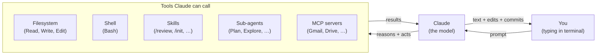

# Claude Code Workflow: Practical Patterns for the CLI Agent

> How to get the most out of Claude Code as a solo dev — the memory system, plan mode, sub-agents, custom slash commands, hooks, and the prompting patterns that work. Written from inside this very setup, where Claude Code is the tool used to maintain the rest of these how-tos.

> [!NOTE]
> **Last validated: 2026-05.** Claude Code current (Opus 4.7 + Sonnet 4.6 + Haiku 4.5 model lineup), the memory + skill + hooks systems, MCP integration patterns. Bump and re-validate as the tool evolves — Claude Code is moving fast.

## What you'll have at the end

- A clear mental model of what Claude Code is and how it interacts with your filesystem, shell, tools, and memory.
- A working `~/.claude/CLAUDE.md` (global) + per-project `CLAUDE.md` files that calibrate Claude's behavior without you having to re-explain context every session.
- A handful of **custom slash commands** for the workflows you repeat.
- **Hooks** for automated behaviors that should happen reliably (formatting, linting, notifications).
- A practical sense of **when to use plan mode**, **when to spawn sub-agents**, and **when to just chat**.
- Prompting patterns that produce useful output instead of generic mush.

## Prerequisites

- Claude Code installed (`npm i -g @anthropic-ai/claude-code` or via your platform's installer).
- An Anthropic API key or Claude.ai Pro/Max subscription with usage included.
- Read access to `~/.claude/` and your project directories.

---

## Table of contents

1. [Mental model: what Claude Code actually is](#1-mental-model-what-claude-code-actually-is)
2. [The memory system: CLAUDE.md and auto-memory](#2-the-memory-system-claudemd-and-auto-memory)
3. [Plan mode: when to slow down](#3-plan-mode-when-to-slow-down)
4. [Sub-agents: when to fan out](#4-sub-agents-when-to-fan-out)
5. [Slash commands and skills](#5-slash-commands-and-skills)
6. [Custom slash commands](#6-custom-slash-commands)
7. [Hooks: automated behaviors that don't require remembering](#7-hooks-automated-behaviors-that-dont-require-remembering)
8. [Permission management](#8-permission-management)
9. [Prompting patterns that work](#9-prompting-patterns-that-work)
10. [Working with dev containers](#10-working-with-dev-containers)
11. [MCP servers: extending capabilities](#11-mcp-servers-extending-capabilities)
12. [Token budgets and context discipline](#12-token-budgets-and-context-discipline)
13. [Common workflows](#13-common-workflows)
14. [Alternatives considered](#14-alternatives-considered)
15. [Quick reference](#15-quick-reference)

---

## 1. Mental model: what Claude Code actually is

Claude Code is a **command-line agent** that runs locally on your machine. It's *not* a chat client that calls an API in the abstract; it has direct access to:

- **Your filesystem** — can read, write, edit files in your working directory (and anywhere it has permission).
- **Your shell** — can run commands, see their output, react to results.
- **Built-in tools** — Read, Write, Edit, Bash, Grep, plus dozens more (TaskCreate, ExitPlanMode, SendUserFile, etc.).
- **Skills** — pre-built workflows you can invoke (`/review`, `/security-review`, `/init`, etc.).
- **MCP servers** — external tools that extend its reach (Gmail, Drive, Slack, custom).
- **Memory** — persistent context across sessions, both manual (`CLAUDE.md` files) and automatic (the `memory/` subsystem).

When you type a message, Claude can call any of these as part of formulating its response. The transcript you see is a conversation interleaved with tool calls, tool results, and Claude's text output.



The agent loop runs until Claude decides it's done responding, then control returns to you for the next prompt.

### What it isn't

- **Not a magic box** that writes whole projects from scratch reliably. It works in a tight loop with you; the more context you give about what good looks like, the more useful it is.
- **Not stateless**. The current session has full context; across sessions, only what's in memory persists (CLAUDE.md and the memory subsystem).
- **Not deterministic**. Same prompt twice may produce different outputs. Treat it as a smart colleague, not a build tool.

---

## 2. The memory system: CLAUDE.md and auto-memory

Memory is the single highest-leverage feature for solo work. Three tiers:

### Tier 1: Global `CLAUDE.md` (`~/.claude/CLAUDE.md`)

Loaded into context for *every* Claude Code session, regardless of directory. Use for:

- Your environment (OS, shell, primary directories).
- Default tooling preferences (`uv` not `pip`, `bun` not `npm`, etc.).
- Personal background that influences calibration (CS background, time constraints, etc.).
- Non-negotiable preferences ("don't add Code Comments unless asked," "always use markdown for docs").

> [!IMPORTANT]
> **Global CLAUDE.md is loaded into every context.** Be selective — it costs tokens forever. ~150 lines is plenty. Anything topic-specific belongs in per-project `CLAUDE.md` files.

### Tier 2: Project `CLAUDE.md` (in a repo)

Loaded when Claude Code is invoked inside that repo (or any subdirectory). Use for:

- Project-specific conventions (the writing standards in this very repo's `CLAUDE.md`, for instance).
- Architecture notes.
- "How to do X in this codebase" patterns.
- Things you'd otherwise re-explain every session.

There's a hierarchy: project CLAUDE.md *adds to* global CLAUDE.md. Both are in context.

### Tier 3: Auto-memory (`~/.claude/projects/<...>/memory/`)

Claude writes memories automatically when you tell it personal facts, preferences, or project context. These are loaded into context too, indexed by `MEMORY.md`.

Categories:

- **`user_*.md`** — facts about you (role, background, expertise).
- **`feedback_*.md`** — guidance you've given (how you prefer work done, things to avoid/repeat).
- **`project_*.md`** — context about specific ongoing projects.
- **`reference_*.md`** — pointers to external resources.

The auto-memory system is *bidirectional*. Claude reads existing memory at session start; it writes new memory when something memorable comes up. You can also ask: "remember that I prefer X" → Claude writes a memory file.

> [!TIP]
> **Audit your memory occasionally.** `~/.claude/projects/<your-home-path>/memory/MEMORY.md` is the index. Open it, read the entries, delete what's stale. Memory drift is real — old preferences accumulate and start making advice worse.

### What goes where (rule of thumb)

| Content | Goes in |
|---|---|
| "I use Bun not Node" | Global CLAUDE.md |
| "This codebase uses SvelteKit + Drizzle" | Project CLAUDE.md |
| "I'm in the Army, doing an MSDS, time-constrained" | Auto-memory (user) |
| "Don't add try/except around code that can't fail" | Auto-memory (feedback) |
| "We're rewriting the auth system in Q3" | Auto-memory (project) |
| "Linear tickets live at company.linear.app/team/X" | Auto-memory (reference) |

---

## 3. Plan mode: when to slow down

Plan mode is a special mode where Claude **doesn't make changes** — it only investigates and produces a written plan. You then approve (or revise) before any code is touched.

### When to use plan mode

- **Multi-step changes** where you want to review the approach before committing time.
- **Anything destructive or hard to reverse** (data migrations, refactors that touch many files).
- **Cross-cutting concerns** where the impact isn't obvious upfront.
- **Estimation tasks** ("how big is this change?" — you want the plan as the answer, not the implementation).

### When NOT to use plan mode

- Quick fixes (typo, single-file change, small refactor).
- Investigations / questions ("what does this file do?").
- Anything where you're going to immediately tell Claude to go anyway.

### How to use it

```
/plan
```

Or just say "make a plan first" in your prompt. Claude switches mode, investigates, writes a plan, presents it via `ExitPlanMode`. You approve or reject; if you approve, Claude proceeds.

The plan should be specific enough that you could hand it to another engineer and they'd execute it. If a plan is vague, push back: "be more specific about what changes to which files."

---

## 4. Sub-agents: when to fan out

Claude Code supports **sub-agents** — spawning another Claude in a separate context to handle a discrete task, then returning the result to the main agent.

Available agent types:

- **`general-purpose`** — flexible; default if you don't specify.
- **`Plan`** — software architect; designs implementation strategies. Read-only.
- **`Explore`** — fast read-only search; for "find me X across this codebase."
- **`claude`** — same as the parent but in a fresh context. Useful for isolating noisy operations from the main context.
- **`claude-code-guide`** — Q&A about Claude Code itself.
- Other specialized agents (varies by version).

### When to spawn a sub-agent

- **Big read-only research** that would clutter the main context. "Find every place we use `process.env.DATABASE_URL` and summarize." → spawn `Explore`.
- **Parallel independent work** — two unrelated investigations can run as two sub-agents simultaneously.
- **Heavy planning** where you want a fresh perspective. "Plan how to migrate from REST to GraphQL." → spawn `Plan`.
- **Anything that'd consume significant context but only the conclusion matters.**

### When NOT to

- Single-file or single-step work. The overhead isn't worth it.
- Tasks where Claude needs to see your full context.
- Anything iterative or conversational.

### Hot tip

**Brief the agent like a smart colleague who walked in mid-meeting.** They have no idea what the conversation has been. Give them:

- What you're trying to accomplish.
- What you've ruled out.
- The specific question or task.
- The format you want back ("under 200 words," "as a list," "as a code patch").

```
Agent({
    description: "audit cross-file consistency",
    subagent_type: "Explore",
    prompt: "We just renamed the `User` table to `Account` in src/db/schema.ts. Find every other file that references the old name (imports, queries, types, comments). Report a list of file:line locations. Under 300 words."
})
```

---

## 5. Slash commands and skills

Slash commands are pre-built workflows you can invoke. The most useful built-ins:

| Command | What it does |
|---|---|
| `/help` | List available commands |
| `/init` | Generate a `CLAUDE.md` for the current project |
| `/review` | Review a PR (open or local branch) |
| `/security-review` | Security-focused review of the current branch |
| `/clear` | Clear the conversation context (start fresh) |
| `/compact` | Summarize old context to save tokens |
| `/agents` | List available sub-agents |
| `/permissions` | Manage tool permissions |
| `/memory` | View/edit memory entries |

User-invocable skills (varies by setup) include things like:

- `update-config` — manage `settings.json`
- `keybindings-help` — keyboard shortcuts
- `simplify` — review code for quality
- `fewer-permission-prompts` — generate an allowlist from your transcripts
- `loop` — recurring task on an interval
- `schedule` — recurring cron-style remote agents

Type `/` to see what's available in your setup.

---

## 6. Custom slash commands

Define your own slash commands as markdown files in `~/.claude/commands/`. Each file is a command template.

Example: `~/.claude/commands/deploy-check.md`

```markdown
You are checking whether the current branch is ready to deploy.

Run these checks in order:

1. `git status` — is the working tree clean?
2. `git diff origin/main..HEAD --stat` — what's changed vs main?
3. Run the test suite (`uv run pytest` or `bun test`, whichever is appropriate).
4. Run lints (`uv run ruff check` or `bun run lint`).
5. Check if `pyproject.toml` / `package.json` versions are bumped if applicable.

For each check, report: ✅ pass / ⚠️ warn / ❌ fail with one line of context.

End with an overall ship/don't-ship verdict.
```

Now `/deploy-check` runs that script-like prompt. Claude interprets each step as a goal and uses tools accordingly.

Other useful custom commands to write:

| Command | Purpose |
|---|---|
| `/spike <topic>` | Quick investigative spike — read related files, summarize the lay of the land |
| `/changelog` | Generate a changelog entry from recent commits |
| `/pr-description` | Write a PR description from the diff |
| `/migrate-todo <from> <to>` | Walk through migrating from one tool/lib/version to another |
| `/dora` | Compute personal DORA metrics for your repos |

### Args

Pass arguments to commands by referencing `$ARGUMENTS` (or just embedding instructions for the user to provide them):

```markdown
You are searching for occurrences of "$ARGUMENTS" across the codebase.
Use Grep with sensible patterns; report file:line matches grouped by file.
```

Invoke: `/find-occurrences DATABASE_URL`.

---

## 7. Hooks: automated behaviors that don't require remembering

Hooks let `settings.json` define **shell commands that run on Claude Code events**. Examples:

- "After every file edit, run `prettier` on the edited file."
- "Before Claude reads a file, log the access for audit."
- "When the model stops talking, send a desktop notification."

Hooks are configured in `~/.claude/settings.json` or per-project `.claude/settings.json`. Schema (simplified):

```json
{
    "hooks": {
        "PostToolUse": [
            {
                "matcher": "Edit|Write",
                "hooks": [
                    {
                        "type": "command",
                        "command": "prettier --write '$CLAUDE_FILE_PATHS' 2>/dev/null || true"
                    }
                ]
            }
        ],
        "Stop": [
            {
                "hooks": [
                    {
                        "type": "command",
                        "command": "notify-send 'Claude finished'"
                    }
                ]
            }
        ]
    }
}
```

### When to use a hook

Anywhere you'd say "from now on, when X happens, do Y" — that's a hook, not a preference. Memory can store *preferences* but can't *execute*. Hooks execute.

Examples worth wiring up:

- **Auto-format after edits** — Prettier for TS, Ruff for Python, gofmt for Go.
- **Auto-lint warning** — fire ESLint/Ruff after edits, print warnings.
- **Notification on Stop** — desktop notification when Claude finishes responding (so you can wander off and come back).
- **Pre-flight check before Bash** — log destructive commands.

### Skills for hooks

`/update-config` is the skill that helps you wire up hooks. Use it; don't hand-edit `settings.json` directly unless you're confident.

---

## 8. Permission management

Each tool Claude tries to use either:

- Auto-runs (whitelisted in `settings.json`'s `permissions.allow`).
- Prompts you (default for most tools).
- Auto-denies (blacklisted in `permissions.deny`).

### The `fewer-permission-prompts` skill

Scans your recent transcripts for tools Claude has used repeatedly with your approval, then proposes adding them to the allowlist. Run it after a few weeks of use to dramatically cut the prompting.

```
/fewer-permission-prompts
```

It'll suggest entries like:

```json
"permissions": {
    "allow": [
        "Bash(git status:*)",
        "Bash(git diff:*)",
        "Bash(ls:*)",
        "Bash(cat:*)",
        "Read",
        "Grep",
        "WebSearch"
    ]
}
```

Accept and you stop getting prompted for read-only operations.

### What to never auto-allow

- **Anything that writes to remote services** (`git push`, `docker push`, `gh ...`) — interactive confirmation is the whole point.
- **Destructive operations** (`rm`, `dd`, `truncate`).
- **Anything that creates billable resources** (cloud APIs).

A reasonable allowlist is: read-only operations everywhere; writes prompt every time.

---

## 9. Prompting patterns that work

### Be specific

Bad: "fix the auth bug"

Good: "the `/api/login` endpoint returns 200 with no body when password is correct but the session cookie isn't set. I think it's the cookie domain config. Trace the request through `src/lib/server/auth.ts` and `hooks.server.ts` and propose a fix."

### Provide pointers, not synthesis

Bad: "based on your research, fix the bug"

Good: "the bug is in `src/lib/server/auth.ts:42`. The issue is that `secure: true` is set even in dev. Fix it conditionally based on `NODE_ENV`."

If you find yourself writing "based on the findings, do X" — you're abdicating the synthesis step. The synthesis step is *where the value is*. Do it yourself or have Claude make the plan first (plan mode).

### State the constraints, including what NOT to do

"Implement the leaderboard endpoint. **Don't:** add new dependencies, change the existing schema, or modify the route file path."

Claude takes prohibitions seriously. Use them when needed.

### Set output expectations

- "Reply in under 100 words."
- "Just write the code; don't explain it."
- "Output the diff only."
- "Summarize in 3 bullets."

Less constraint = more output. Pick the constraint that matches what you actually want.

### Give worked examples for non-obvious style

If you have specific style preferences ("use guard clauses, not nested ifs" / "use `const` arrow functions, not `function`"), give a code snippet of the desired style. It's faster than describing.

### When prompting for code: name the failure modes

"Write a function to parse the CSV. Handle these edge cases explicitly:

- Empty file → return `[]`.
- File with only a header row → return `[]`.
- Quoted strings with embedded commas → preserve.
- Missing trailing newline → still parse the last row.
- BOM at start → strip and parse normally.

Don't catch exceptions broadly; let parse errors propagate."

You get cleaner code because the spec is clearer.

---

## 10. Working with dev containers

Claude Code can run inside a Dev Container. The "Reopen in Container" flow attaches a remote Claude instance to the container environment. It uses the container's filesystem, the container's installed tools, and the SSH agent forwarded into the container ([ssh-keys](../ssh-keys/README.md)).

### Why use Claude Code inside the container

- The tools Claude uses (uv, bun, alembic, pytest) are the project's tools — installed in the container, not on your host.
- Git operations Claude initiates use your forwarded SSH agent, so `git push` works without setup.
- Side effects (file writes, command output) stay scoped to the container.

### Things to watch for

- **`.claude/` in the project** — settings and memory may or may not be in the repo. If you want them committed (project-specific), put them under `.claude/`. If not, leave them in `~/.claude/`.
- **Memory paths** are relative to `$HOME` of whatever user Claude is running as inside the container.

---

## 11. MCP servers: extending capabilities

MCP (Model Context Protocol) servers add tools beyond what Claude Code ships with. Common ones:

- **Gmail** — search threads, read messages, create drafts.
- **Drive** — search, read, create files.
- **GitHub** — issues, PRs (beyond what `gh` CLI exposes).
- **Slack** — read/write messages.
- **Linear / Notion / Asana** — task management integration.
- **Custom** — anything you can wrap in an MCP server.

Configure in `~/.claude/settings.json` under `mcpServers`. Each server runs as a subprocess; Claude calls its tools through the protocol.

> [!TIP]
> **Most MCPs are loaded lazily.** They show up in the deferred-tools list and only get full schemas when Claude invokes `ToolSearch`. This keeps context-overhead low for unused integrations.

The Claude.ai connectors (Gmail, Drive, Calendar) are pre-wired if you've enabled them in your Claude.ai account settings.

---

## 12. Token budgets and context discipline

Each session has a context window (1M tokens for Opus 4.7 with 1M variant; 200k for others). You can lose effectiveness toward the end of long sessions when context fills up.

### Strategies

- **`/clear`** — wipe the conversation, start fresh. Use after a big task is done.
- **`/compact`** — summarize the older portion of the conversation, retain recent specifics. Less brutal than `/clear`.
- **Spawn sub-agents for big read-only tasks** — keeps the main context lean.
- **Avoid asking Claude to "read all the files in the repo"** — it loads them into your context. Use Explore or Grep to surface only what you need.

### Memory vs context

- **Context** = current conversation; gone after `/clear`.
- **Memory** = persisted across sessions in `~/.claude/`.

Move things from context → memory deliberately when they're stable preferences. The "remember that" prompt does this explicitly.

---

## 13. Common workflows

### "Write a new feature end-to-end"

1. Open the repo in VS Code, reopen in dev container.
2. Type: "I want to add a `/leaderboard` slash command. Tables: there's already a `scores` table. UX: top 10 by total score. /plan first."
3. Claude enters plan mode, investigates, produces a plan.
4. You approve or revise: "look good — also add tests for empty leaderboard case."
5. Approve final plan.
6. Claude implements: writes the route, the test, the migration if needed.
7. You review the diff: `git diff`.
8. Push + PR via `gh pr create --fill`.

### "Investigate a bug"

1. "There's a 500 error on `/api/auth/login` when password contains an emoji. Trace what happens."
2. Claude reads the relevant files, traces the call path, reports findings.
3. You decide on the fix (the value-add step) and tell Claude to implement it.

### "Code review"

`/review` against the current branch. Claude reads the diff, comments on what it sees, suggests improvements. Iterate or accept.

### "Refactor"

For multi-file refactors, plan mode is essential. Without it, Claude can drift mid-task. With it, you've agreed on the approach before edits start.

### "Write or update a how-to"

Following this repo's pattern: write the README, update CLAUDE.md and the top-level index, commit + push. Claude can drive this loop with one or two prompts if the topic is clear.

---

## 14. Alternatives considered

| Tool | Verdict | Why |
|---|---|---|
| **Claude Code** (this guide) | Default. | Best agent UX as of 2026; memory + skills + hooks are unique; great Anthropic model lineup. |
| **Cursor** | Solid editor-integrated alternative. | If you want IDE-first rather than CLI-first. Editor-native UX wins for some workflows. |
| **Aider** | Open-source CLI agent. | More transparent (you see every call), works with multiple LLM backends. Less polish than Claude Code. |
| **GitHub Copilot Chat** | Built into VS Code. | Better for "this line, suggest a completion." Worse for "make a multi-step change across the codebase." |
| **Continue** | Open-source VS Code extension. | Multi-LLM, configurable. Smaller community than Cursor. |
| **Plain ChatGPT/Claude.ai web** | Fine for one-off questions. | No filesystem access, no shell, no memory persistence with your real code. Lose the agent advantages. |
| **Sourcegraph Cody** | Enterprise-focused. | Better for organization-wide code search; overkill for solo. |

For solo dev workflow, **Claude Code wins on the trifecta of memory + agentic loop + Anthropic model quality**. The cost is being tied to one vendor; the gain is the fastest path from "I have an idea" to "PR is open."

---

## 15. Quick reference

### Files and dirs

| Path | Purpose |
|---|---|
| `~/.claude/CLAUDE.md` | Global instructions, loaded every session |
| `~/.claude/settings.json` | Permissions, hooks, MCP servers |
| `~/.claude/commands/*.md` | Custom slash commands |
| `~/.claude/projects/<...>/memory/MEMORY.md` | Auto-memory index |
| `~/.claude/projects/<...>/memory/*.md` | Individual memory files |
| `<repo>/CLAUDE.md` | Project-specific instructions |
| `<repo>/.claude/settings.json` | Project-specific settings |

### Slash commands worth knowing

```
/init                   # generate CLAUDE.md for current repo
/clear                  # wipe conversation context
/compact                # summarize old context
/plan                   # enter plan mode
/review                 # PR review of current branch
/agents                 # list available sub-agents
/permissions            # manage tool allowlist
/memory                 # view/edit memory
/help                   # list everything
/fewer-permission-prompts  # auto-generate allowlist from transcripts
/update-config          # configure hooks/settings
```

### Custom command template

```markdown
You are <doing a thing>.

Steps:
1. ...
2. ...

Constraints:
- Don't ...
- Do ...

Output format:
- ...
```

Save as `~/.claude/commands/<name>.md`, invoke as `/<name>`.

### Hook templates

`settings.json`:

```json
{
    "hooks": {
        "PostToolUse": [
            { "matcher": "Edit|Write", "hooks": [
                { "type": "command", "command": "prettier --write '$CLAUDE_FILE_PATHS' 2>/dev/null || true" }
            ]}
        ],
        "Stop": [
            { "hooks": [
                { "type": "command", "command": "notify-send 'Claude finished'" }
            ]}
        ]
    }
}
```

### Prompting cheat sheet

- **Be specific.** Names, file paths, function names, expected behavior.
- **State constraints.** What NOT to do is just as important as what TO do.
- **Set output format.** "Reply in 100 words." "Diff only." "Bullet list."
- **Don't abdicate synthesis.** If you find yourself saying "based on findings, implement X," do the synthesis yourself.
- **Use plan mode** for multi-step or destructive work.
- **Use sub-agents** for big read-only exploration or parallel independent work.

### When to /clear

- After completing a big task and starting an unrelated one.
- When responses start getting slower or less relevant.
- When the conversation has accumulated 50+ messages of mixed topics.

### Memory hygiene

- `/memory` to view what's been captured.
- Read `MEMORY.md` index quarterly; delete stale entries.
- Be explicit when you want something remembered: "remember that I prefer X."
- Be explicit when something is one-off: "for this conversation only…"
