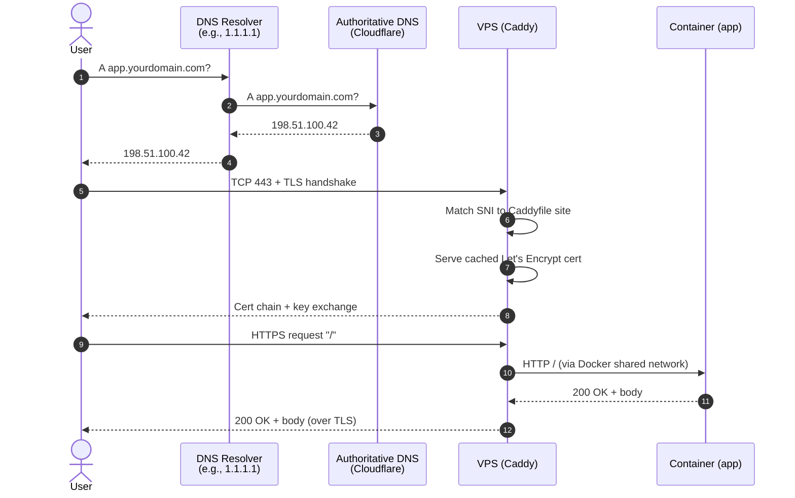

# Domains, Caddy, and HTTPS: From `apex.example.com` to a Production-Ready Stack

> Everything between "I want a real domain for my project" and "the green padlock appears, requests reach the right container." Domain registration, DNS configuration, Caddy reverse proxy deep dive, Let's Encrypt mechanics, Cloudflare considerations, and the operational stuff that breaks at 11pm.

> [!NOTE]
> **Last validated: 2026-05.** Caddy v2 current, Let's Encrypt ACME v2, Cloudflare DNS + proxy current, Cloudflare Registrar at-cost pricing. Bump and re-validate annually per [CLAUDE.md](../CLAUDE.md) standard #5.

## What you'll have at the end

- A domain you own, registered through a non-predatory registrar.
- DNS configured to point at your VPS, with sensible defaults for subdomains.
- Caddy serving HTTPS for one or more apps, with automatic Let's Encrypt cert renewal.
- A clear decision on whether to put Cloudflare's proxy (the "orange cloud") in front of your origin — and the config for whichever choice.
- An email-at-your-domain story (forwarding only, since nobody should self-host a mail server in 2026).
- The understanding to debug "the cert won't issue" and "the domain isn't resolving" without panic.

## Prerequisites

- A working VPS from [vps-from-zero](../vps-from-zero/README.md). Specifically: Caddy added to the `infra/` stack from the [dockerized-deployments](../dockerized-deployments/README.md) guide.
- A credit card / payment method for the domain registrar.
- ~45 minutes if you're going through it start to finish for the first time. Subsequent domains are 5 minutes.

---

## Table of contents

1. [The shape of a request](#1-the-shape-of-a-request)
2. [Buying the domain](#2-buying-the-domain)
3. [DNS basics: just enough to be dangerous](#3-dns-basics-just-enough-to-be-dangerous)
4. [Pointing the domain at the VPS](#4-pointing-the-domain-at-the-vps)
5. [Caddy: the reverse proxy](#5-caddy-the-reverse-proxy)
6. [HTTPS / Let's Encrypt under the hood](#6-https--lets-encrypt-under-the-hood)
7. [Cloudflare proxy: the orange cloud](#7-cloudflare-proxy-the-orange-cloud)
8. [Wildcard certs](#8-wildcard-certs)
9. [Subdomain strategy](#9-subdomain-strategy)
10. [Email at your domain](#10-email-at-your-domain)
11. [Operational checklist](#11-operational-checklist)
12. [Troubleshooting](#12-troubleshooting)
13. [Alternatives considered](#13-alternatives-considered)
14. [Quick reference](#14-quick-reference)

---

## 1. The shape of a request

Before configuring anything, internalize what happens when a browser hits `https://app.yourdomain.com`:



The pieces:

- **DNS** — translates the human-readable name (`app.yourdomain.com`) into an IP address (`198.51.100.42`). You configure this at your DNS provider (Cloudflare, in this guide).
- **VPS / Caddy** — the IP address you pointed DNS at. Caddy listens on 80/443 and decides which app gets the request based on the `Host:` header (or TLS SNI extension for HTTPS).
- **The app container** — running on the shared Docker network, reachable from Caddy by service name (e.g., `dashboard:3000`).
- **TLS certificate** — Caddy obtains it from Let's Encrypt automatically the first time the domain resolves to your VPS. Renewals happen ~30 days before expiry, also automatic.

If any of these is wrong, requests fail at that layer. The troubleshooting section (§12) is organized by layer for that reason.

---

## 2. Buying the domain

### Where to buy

| Registrar | Verdict | Why |
|---|---|---|
| **Cloudflare Registrar** | ✅ **Default choice.** | At-cost pricing (literally — they don't mark up). Free WHOIS privacy. Native integration with Cloudflare DNS. No upsells. |
| **Porkbun** | ✅ Excellent alternative. | Cheap, clean UI, no upsells, free WHOIS privacy. Works fine with Cloudflare DNS. Closest competitor to CF Registrar. |
| **Namecheap** | OK | Fine. Slightly more expensive than CF/Porkbun. WHOIS privacy free. |
| **Squarespace Domains** (former Google Domains) | OK | Acquired Google Domains. Clean UI but more expensive. |
| GoDaddy / Network Solutions / Register.com | ❌ Avoid. | Overpriced, predatory upsells, intrusive cross-selling, manipulative renewal pricing. Pay the same money to literally anyone else. |
| Dynadot | OK if you need exotic TLDs | Specializes in unusual TLDs. Otherwise unremarkable. |

> [!IMPORTANT]
> **Use Cloudflare Registrar unless there's a specific reason not to.** They charge wholesale (their cost from the registry). For a `.com` that's around $10/year. Anyone charging $15-25/year is marking it up; anyone charging $40+/year is gouging you.

### TLD choice

For personal projects, ranked rough preference:

1. **`.com`** — gold standard, instantly recognized, highest trust.
2. **`.dev`, `.app`** — Google-operated, HTTPS-only enforced (HSTS preload), modern feel.
3. **`.io`, `.co`, `.so`** — common with developers; slightly pricier.
4. **Your country TLD** (`.us`, `.ca`, `.uk`, etc.) — fine.
5. Avoid: `.xyz`, `.online`, `.club`, `.click` — historically associated with spam, sometimes lower trust scores from email providers, often used as cheap throwaway domains for malicious purposes.

The new gTLDs (`.dev`, `.app`, `.tech`, etc.) used to be exotic; in 2026 they're mainstream.

### Procurement steps

1. Go to [dash.cloudflare.com](https://dash.cloudflare.com) → Domain Registration → Register Domains.
2. Search for the name. Buy it.
3. The domain auto-arrives in your Cloudflare account with DNS hosted there by default.

Or for Porkbun: register at porkbun.com, then add the domain to Cloudflare DNS separately (Cloudflare Dashboard → Add Site → enter domain → choose Free plan → update nameservers at Porkbun to point at Cloudflare's NS records).

> [!TIP]
> **Use Cloudflare for DNS even if you don't buy the domain from them.** Free, fast, reliable, has the best API of any DNS provider, supports DNSSEC. Their proxy ("orange cloud") is optional — you can keep records DNS-only ("gray cloud") and still use their DNS infrastructure. See §7 for the proxy decision.

### Lock it down once registered

1. **Enable two-factor auth** on the registrar account (already set if you use Cloudflare with hardware key or TOTP).
2. **Enable registrar lock** (`clientTransferProhibited`). Default on Cloudflare. Prevents transfer hijacking.
3. **Enable WHOIS privacy** (default at CF, Porkbun, Namecheap). Hides your address/phone from public WHOIS lookups.

> [!CAUTION]
> **Domain account compromise is catastrophic.** An attacker who takes over your domain account can point DNS at their server, intercept all email (including password resets), and impersonate you online — all without your knowledge until you notice. Use 2FA. Use a strong unique password. Treat the registrar like a bank.

---

## 3. DNS basics: just enough to be dangerous

DNS records you'll actually use:

| Type | What it does | Example |
|---|---|---|
| `A` | Maps a name to an IPv4 address | `app A 198.51.100.42` |
| `AAAA` | Maps a name to an IPv6 address | `app AAAA 2001:db8::1` |
| `CNAME` | Aliases one name to another | `www CNAME yourdomain.com` |
| `TXT` | Arbitrary text — used for verification, SPF, DKIM, DMARC | `_acme-challenge TXT "abc123..."` |
| `MX` | Mail server for the domain | `@ MX 10 mail.yourdomain.com` |
| `NS` | Authoritative nameservers (set at registrar, not in zone) | — |

What you probably *don't* need:

- `SRV`, `PTR` — service-specific or reverse DNS, niche.
- `CAA` — Certificate Authority Authorization. Useful for security; optional.

### Hostname vs domain naming

A "record name" in DNS is **relative to the zone**. If your zone is `yourdomain.com`:

- `@` (or empty) = `yourdomain.com` itself ("the apex").
- `www` = `www.yourdomain.com`.
- `app.staging` = `app.staging.yourdomain.com`.

DNS providers usually let you enter either the bare hostname (`app`) or the full FQDN (`app.yourdomain.com`); both work.

### TTL

Each record has a TTL (time to live), in seconds, that tells resolvers how long to cache it. Default at Cloudflare is "Auto" (300s = 5 minutes, which is fine).

**Lower TTL** = faster propagation when you change records, but more DNS query traffic. Useful temporarily when you're about to migrate something (drop TTL to 60s, change record, restore to default after stable).

**Higher TTL** = slower propagation, less query traffic. Useful for records that never change (your apex pointing at your VPS).

For personal use, leave TTLs at the default and ignore them unless you're actively migrating.

---

## 4. Pointing the domain at the VPS

Two steps: one A record (and optionally AAAA), and a wildcard or per-app CNAMEs.

### The apex + the wildcard

This is the simplest workable setup:

| Type | Name | Value | Proxy |
|---|---|---|---|
| `A` | `@` | `198.51.100.42` (your VPS IPv4) | Up to you (see §7) |
| `AAAA` | `@` | `2001:db8::42` (your VPS IPv6, if you have one) | Same as A |
| `A` | `*` | `198.51.100.42` | Same as A |

`*` is a wildcard — anything-not-explicitly-defined resolves to the same IP. So `app.yourdomain.com`, `dashboard.yourdomain.com`, `dev.yourdomain.com` all hit your VPS. Caddy decides which app gets the request based on the `Host:` header.

### Per-app records (alternative)

If you'd rather declare each subdomain explicitly:

| Type | Name | Value |
|---|---|---|
| `A` | `app` | `198.51.100.42` |
| `A` | `dashboard` | `198.51.100.42` |
| `A` | `api` | `198.51.100.42` |

More precise, more maintenance. The wildcard is fine for personal use.

### Don't forget the apex

Many people set up subdomains and forget the apex — then `yourdomain.com` doesn't resolve. Either:

- Add the explicit `A @` record (as above), or
- Use `www.yourdomain.com` as your canonical and redirect apex to it (less common in 2026).

> [!TIP]
> **Use the apex.** `yourdomain.com` reads better than `www.yourdomain.com`. Add `www` as a CNAME → apex redirect if you want both to work.

### IPv6 (AAAA)

If your VPS has an IPv6 address (most do in 2026), add an `AAAA` record alongside each `A`. About 50% of requests in many regions come over IPv6; serving v4-only gates you out of part of the audience.

Find your VPS's IPv6:

```bash
ssh myvps "ip -6 addr show eth0"
# or
ssh myvps "curl -6 ifconfig.me"
```

Add to DNS:

| Type | Name | Value |
|---|---|---|
| `AAAA` | `@` | `2001:db8::42` |
| `AAAA` | `*` | `2001:db8::42` |

Open IPv6 in the firewall:

```bash
sudo ufw allow OpenSSH
sudo ufw allow 80
sudo ufw allow 443
# UFW automatically applies these to v4 and v6
```

---

## 5. Caddy: the reverse proxy

Caddy v2 is the only mainstream reverse proxy that **handles certificates automatically by default**. Other proxies (nginx, Traefik) can do it with config; Caddy does it because that's the whole point of the project.

The Caddyfile sits at `/home/deploy/infra/Caddyfile` (per the dockerized-deployments setup). A minimal version:

```caddy
app.yourdomain.com {
    reverse_proxy app:3000
}

dashboard.yourdomain.com {
    reverse_proxy dashboard:3000
}
```

That's it. Caddy reads the file, notices the two site blocks, asks Let's Encrypt for certs for both names, starts serving HTTPS. It also automatically:

- Listens on 80 and redirects to 443.
- Sets HSTS headers.
- Selects modern TLS ciphers and protocols.
- Renews certs ~30 days before expiry.

### Caddyfile syntax in depth

```caddy
# Comments start with #

# A "site block" applies to one or more hostnames
example.com, www.example.com {
    # Directives go inside the block
    reverse_proxy backend:8080
    encode gzip zstd      # compress responses
    log {
        output file /var/log/caddy/access.log
    }
}

# Snippet (reusable block)
(common_headers) {
    header X-Content-Type-Options nosniff
    header X-Frame-Options DENY
    header Referrer-Policy strict-origin-when-cross-origin
}

api.example.com {
    import common_headers   # apply the snippet
    reverse_proxy api:9000
}

# Multiple sites can share the same block
app1.example.com, app2.example.com {
    reverse_proxy upstream:80
}

# Path-based routing
example.com {
    handle /api/* {
        reverse_proxy api:9000
    }
    handle /static/* {
        root * /var/www/static
        file_server
    }
    handle {
        reverse_proxy frontend:3000
    }
}

# HTTP-only site (skip TLS) — rare; for internal/Tailscale use
http://internal.example.com:8080 {
    reverse_proxy backend:80
}
```

### Common directives

| Directive | What it does |
|---|---|
| `reverse_proxy` | Forward requests to a backend |
| `file_server` | Serve static files from disk |
| `root` | Set the document root for `file_server` |
| `handle` | Group directives for a specific path/predicate |
| `handle_path` | Like `handle` but strips the prefix from the path |
| `respond` | Return a fixed response |
| `redir` | HTTP redirect |
| `encode` | Compression (gzip, zstd) |
| `header` | Set response headers |
| `log` | Access logging |
| `rewrite` | Internal URL rewriting |
| `basicauth` | HTTP Basic auth |
| `tls` | TLS-specific config (cert source, etc.) |

### Reload without downtime

After editing the Caddyfile:

```bash
ssh myvps
cd ~/infra
docker compose exec caddy caddy reload --config /etc/caddy/Caddyfile
```

Caddy reloads gracefully — in-flight requests complete, new requests hit the new config. No downtime. No container restart needed.

> [!TIP]
> **Validate before reloading.** `docker compose exec caddy caddy validate --config /etc/caddy/Caddyfile` parses the Caddyfile and reports errors without applying. Useful when you're not sure if your edit is syntactically valid.

### What Caddy does with TLS by default

For each hostname in your Caddyfile, Caddy:

1. Checks if it has a cached cert and key (`/data/caddy/certificates/`). Uses them if valid.
2. If no valid cert: attempts to obtain one from Let's Encrypt via the **TLS-ALPN-01** challenge (over port 443). If that fails, falls back to **HTTP-01** (over port 80). Both require the domain to actually resolve to this server.
3. Sets up auto-renewal in the background.
4. Serves HTTPS with the obtained cert.

> [!WARNING]
> **DNS must already resolve to your VPS *before* Caddy starts, or the cert won't issue.** Let's Encrypt validates that you control the domain by checking that the domain points at the server requesting the cert. Common failure mode: add the site to Caddyfile before adding the DNS record → Caddy retries → eventually hits Let's Encrypt's rate limits.

---

## 6. HTTPS / Let's Encrypt under the hood

You don't *need* to understand this to use Caddy, but knowing what's happening prevents panic when something fails.

### ACME

Let's Encrypt speaks the **ACME** protocol (RFC 8555). ACME is "a protocol for automated certificate issuance." Caddy is an ACME client. The flow:

1. Caddy: "Hi Let's Encrypt, I'd like a cert for `app.yourdomain.com`."
2. LE: "Prove you control that domain. Here's a challenge token."
3. Caddy: serves the token at `http://app.yourdomain.com/.well-known/acme-challenge/<token>` (HTTP-01) OR puts it in a TLS ALPN response (TLS-ALPN-01) OR sets a DNS TXT record at `_acme-challenge.app.yourdomain.com` (DNS-01).
4. LE: connects to the domain, fetches the token, verifies it matches.
5. LE: "Validated. Here's your cert."
6. Caddy: stores the cert + key locally, starts serving HTTPS, schedules renewal.

### The three challenge types

| Challenge | How it works | When Caddy uses it |
|---|---|---|
| **TLS-ALPN-01** | LE makes a TLS handshake with ALPN extension `acme-tls/1`; Caddy responds with a special cert. | Default. Works as long as port 443 is reachable from LE. |
| **HTTP-01** | LE makes an HTTP request to `/.well-known/acme-challenge/<token>`. | Fallback. Works as long as port 80 is reachable. |
| **DNS-01** | LE looks up a TXT record at `_acme-challenge.<domain>`. | When you need a wildcard cert, or when neither 80 nor 443 is publicly reachable. Requires DNS provider API access. |

### Rate limits

Let's Encrypt rate-limits to prevent abuse:

- **50 certs / week / registered domain.** Plenty for normal use.
- **5 duplicate certs / week** (same domain set). You'd hit this only if you're testing in a loop.
- **5 failed validation attempts / hour / account / hostname.** This is the one you can hit by accident. If Caddy can't validate, it'll retry, and after a few failures you're locked out for an hour.

> [!CAUTION]
> If you're seeing repeated failures and Caddy keeps retrying, **stop**. Check why validation is failing (DNS not resolving, firewall blocking, wrong port) before letting more attempts run. Wait an hour if you've already hit the limit.

### Staging environment

Let's Encrypt has a **staging** environment that issues untrusted certs but doesn't enforce rate limits. Useful for testing your setup. To use it with Caddy:

```caddy
{
    # Global options block — at the top of the Caddyfile
    acme_ca https://acme-staging-v02.api.letsencrypt.org/directory
}

app.yourdomain.com {
    reverse_proxy app:3000
}
```

Run this once, confirm the cert issues without errors (it'll be untrusted in browsers — that's expected), then comment out the `acme_ca` line and reload to switch to production.

### Renewal

Caddy renews ~30 days before expiry, automatically, in the background. You'll see entries in Caddy's logs:

```
2026-06-15 03:21:08 INFO caddy automatic certificate management:
  app.yourdomain.com: renewing certificate
2026-06-15 03:21:14 INFO certmagic:
  Certificate obtained successfully [app.yourdomain.com]
```

If renewal fails (e.g., domain was moved, firewall changed), Caddy retries with exponential backoff. As long as something is fixable within ~30 days of failure, you have headroom.

To force-renew now (rarely needed):

```bash
docker compose exec caddy caddy reload --config /etc/caddy/Caddyfile --force
```

---

## 7. Cloudflare proxy: the orange cloud

In Cloudflare's DNS UI, each record has a toggle:

- 🔘 **DNS only** (gray cloud) — Cloudflare just answers the DNS query; traffic goes directly to your origin IP.
- 🟠 **Proxied** (orange cloud) — DNS answers point at Cloudflare's edge IPs; CF receives traffic, optionally transforms it, forwards to your origin.

### What the orange cloud gets you

- **DDoS protection.** Free, automatic. CF's network absorbs floods that would crash your VPS.
- **Hidden origin IP.** Browsers and tools see CF's IP, not your VPS. Makes targeted attacks on the VPS harder.
- **TLS termination at the edge.** CF gets a cert for your domain (free), serves HTTPS to clients, may speak HTTP or HTTPS to your origin. (Configurable.)
- **Caching of static assets.** Reduces origin bandwidth.
- **Web Application Firewall (WAF).** Free tier has basic rules; paid tiers add more.
- **Analytics.** Free per-domain stats.

### What the orange cloud costs you

- **CF terminates TLS.** The clients' cert is CF's, not yours. CF can in principle see your traffic in plaintext between edge and origin (unless you're using their full-strict TLS mode, which still terminates at CF).
- **Some protocols don't work.** Non-HTTP TCP and UDP need different CF products ("Spectrum," paid).
- **Edge IPs change.** CF rotates their IPs; you can't whitelist them statically.
- **HTTPS bot/scraper detection** can break legitimate clients (e.g., your own automation hitting your own API).
- **Lock-in.** Once your DNS is on CF and your traffic flows through their edge, leaving requires DNS migration + cert reissuance.

### When to use the orange cloud

| Site type | Recommendation |
|---|---|
| Public web app or API | 🟠 Proxied. DDoS protection alone is worth it. |
| Internal dashboard (only you visit) | 🔘 DNS only. CF adds latency, value is low. |
| Discord bot, no inbound HTTP | N/A (no DNS record needed, bot is outbound-only) |
| Server you SSH to | 🔘 DNS only. CF doesn't proxy SSH on the free tier. |
| Cert-issuance domain (`_acme-challenge.*`) | 🔘 DNS only. Caddy needs LE to reach your origin directly for TLS-ALPN-01. |
| Subdomain you want a wildcard cert for | 🔘 DNS only (and use DNS-01). See §8. |

> [!IMPORTANT]
> **When you proxy a domain, Caddy can't get a Let's Encrypt cert via TLS-ALPN-01.** Cloudflare intercepts the TLS handshake. Caddy will fall back to HTTP-01 (which still works because CF passes through the `/.well-known/acme-challenge/` path). But the cleaner setup with a proxied domain is to let CF handle TLS at the edge and configure Caddy's origin connection as HTTP — see "Two-tier TLS" below.

### Two-tier TLS (proxied)

When proxied:

- Client ↔ Cloudflare: HTTPS with CF's cert.
- Cloudflare ↔ Origin: configurable. Options:
  - **Off:** plain HTTP. Don't.
  - **Flexible:** HTTPS to client, HTTP to origin. Bad — half of the encryption story missing.
  - **Full:** HTTPS to client, HTTPS to origin with any cert (CF doesn't verify). OK.
  - **Full (strict):** HTTPS to client, HTTPS to origin with a valid public cert. **Recommended.**

In Cloudflare's dashboard: SSL/TLS → Overview → Set encryption mode to **"Full (strict)"**.

With Full (strict), Caddy keeps issuing Let's Encrypt certs as usual; CF connects to your origin over HTTPS and verifies the cert; if Caddy stops serving valid HTTPS for any reason, CF stops proxying. Defense in depth.

### My default: proxied for public, DNS-only for private

For a typical personal setup:

- `app.yourdomain.com` → 🟠 Proxied (public web app, want DDoS protection)
- `api.yourdomain.com` → 🟠 Proxied (same)
- `dashboard.yourdomain.com` → 🔘 DNS only (only you visit; CF adds nothing)
- `vpn.yourdomain.com` (Tailscale) → 🔘 DNS only (CF doesn't proxy WireGuard)

---

## 8. Wildcard certs

A wildcard cert covers `*.yourdomain.com` — every subdomain, with one certificate. Useful when you have many subdomains and don't want to issue a new cert each time you add one.

### When wildcards are worth it

- You have 5+ subdomains.
- Subdomains are created dynamically (e.g., one per customer / project).
- You want to avoid TLS-related issues when adding a new subdomain.

When *not* worth it:

- You have 2-3 long-lived subdomains. Per-domain certs work fine and are simpler.

### Getting a wildcard cert with Caddy

Wildcard certs require the **DNS-01 challenge** because there's no way to validate `*.yourdomain.com` via HTTP (there's no single URL that represents "every subdomain"). DNS-01 requires Caddy to set a TXT record on `_acme-challenge.yourdomain.com` during validation, which means Caddy needs your DNS provider's API.

Caddy supports this via plugins. For Cloudflare:

**Build a Caddy image with the Cloudflare DNS plugin:**

`Dockerfile.caddy`:

```dockerfile
FROM caddy:2-builder AS builder
RUN xcaddy build \
    --with github.com/caddy-dns/cloudflare

FROM caddy:2
COPY --from=builder /usr/bin/caddy /usr/bin/caddy
```

Update `infra/docker-compose.yml`:

```yaml
caddy:
  build:
    context: .
    dockerfile: Dockerfile.caddy
  # ... rest stays the same
  environment:
    CLOUDFLARE_API_TOKEN: ${CLOUDFLARE_API_TOKEN}
```

Create a Cloudflare API token (Profile → API Tokens → Create Token):

- Permissions: `Zone > Zone:Read`, `Zone > DNS:Edit`
- Zone resources: `Include > Specific zone > yourdomain.com`

Put it in `~/infra/.env`:

```
CLOUDFLARE_API_TOKEN=<the-token>
```

Update Caddyfile:

```caddy
*.yourdomain.com {
    tls {
        dns cloudflare {env.CLOUDFLARE_API_TOKEN}
    }

    @app host app.yourdomain.com
    handle @app {
        reverse_proxy app:3000
    }

    @dashboard host dashboard.yourdomain.com
    handle @dashboard {
        reverse_proxy dashboard:3000
    }

    # Default: 404
    respond 404
}
```

Now one cert covers every subdomain. Caddy auto-renews via the DNS-01 challenge.

> [!NOTE]
> **The DNS-01 challenge requires the subdomain to be DNS-only (gray cloud)** in Cloudflare during validation, OR you need to use Cloudflare's *origin server certificates* (which are CF-issued and only valid for connections between CF and your origin). Wildcards + CF proxy is more complex than wildcards + DNS-only.

---

## 9. Subdomain strategy

How to organize subdomains for a personal setup.

### Recommended convention

| Subdomain | For |
|---|---|
| `yourdomain.com` (apex) | Your main / canonical site. Or a landing page. |
| `www` | Redirect to apex (or vice versa). Pick one canonical. |
| `app.` | Your primary application. |
| `api.` | Your application's API. |
| `dashboard.` | Admin / internal dashboard (consider DNS-only / Tailscale). |
| `staging.` | Pre-production. Same code, separate DB. |
| `<project-name>.` | One subdomain per side project. |

### Naming rules

- **Short.** `app` not `application`. `api` not `application-programming-interface-server`.
- **Predictable.** Anyone reading your URLs should be able to guess where things live.
- **Stable.** Don't rename subdomains casually. Existing links break, indexed search results 404, bookmarks die.

### Subdomain vs path

You can route either by **subdomain** (`api.example.com`) or **path** (`example.com/api`). Tradeoffs:

| Subdomain | Path |
|---|---|
| Independent services can be entirely separate (different teams, languages, deploys) | Single deploy unit; everything under one app |
| Cookies / auth state can be scoped per subdomain (security boundary) | Cookies share by default |
| Each subdomain needs its own cert (unless wildcard) | One cert |
| DNS record per subdomain | No DNS work |

For personal projects with multiple distinct services on a single VPS: **subdomain per service.** It maps onto the docker-compose stack-per-app pattern.

---

## 10. Email at your domain

You want `you@yourdomain.com` to work. You **do not** want to run a mail server in 2026 — IP reputation issues alone make it nearly impossible to deliver to Gmail / Outlook.

### For receiving only (the simple path)

**Cloudflare Email Routing** (free):

1. Cloudflare dashboard → Email → Email Routing.
2. Add destination address: where mail to your domain should forward (your existing Gmail).
3. Cloudflare auto-configures MX, SPF, DKIM, DMARC records.
4. Verify destination via the email Cloudflare sends.
5. Add routes:
   - `you@yourdomain.com → joshuawjulian@gmail.com`
   - `info@yourdomain.com → joshuawjulian@gmail.com`
   - Catch-all `*@yourdomain.com → joshuawjulian@gmail.com` (optional)

Now mail to `you@yourdomain.com` arrives in your Gmail. You can reply, but the reply will be **from** your Gmail address. For most personal use, that's fine.

### For sending as `you@yourdomain.com` too

You want recipients to see mail "from" your custom address. Options:

- **Gmail "Send mail as"** — set up Gmail to send via SMTP from your custom address. Requires an SMTP provider (see below). Free if you find a free SMTP.
- **Fastmail** — $5/month, full email at your domain, IMAP, custom domains, no ads. Probably the best paid personal email.
- **Migadu** — $20/year, similar to Fastmail. Cheap.
- **ProtonMail** — privacy-focused; custom domains on paid plans.

For free SMTP-to-send-as:

- **Resend** — generous free tier (3k emails/month, 100/day) intended for transactional but works for personal.
- **Mailgun** — free tier limited; mostly for transactional.
- **Brevo** (former Sendinblue) — free tier 300/day.

### What gets configured

When Cloudflare Email Routing sets things up:

```
@         MX      10 route1.mx.cloudflare.net
@         MX      82 route2.mx.cloudflare.net
@         MX      94 route3.mx.cloudflare.net
@         TXT     "v=spf1 include:_spf.mx.cloudflare.net ~all"
```

If you also want to send mail from your domain (e.g., to enable the Gmail "Send mail as" workflow), you'd add SPF entries for the sending provider and DKIM keys provided by them.

---

## 11. Operational checklist

After setting up a new domain + Caddy site:

- [ ] DNS resolves: `dig +short app.yourdomain.com` returns your VPS IP.
- [ ] Port 80 open: `curl -I http://app.yourdomain.com` returns a 301 (Caddy redirecting to HTTPS).
- [ ] Port 443 open: `curl -I https://app.yourdomain.com` returns a 200 (or whatever the app responds with).
- [ ] Valid cert: `openssl s_client -connect app.yourdomain.com:443 -servername app.yourdomain.com < /dev/null 2>&1 | openssl x509 -noout -dates` shows a recent issuance.
- [ ] HSTS header present: `curl -sI https://app.yourdomain.com | grep -i strict-transport`.
- [ ] App actually works: load it in a browser.
- [ ] Caddy logs are clean: `docker compose -f ~/infra/docker-compose.yml logs caddy --tail=50`.

If you operate multiple sites, write a quick health-check script:

```bash
#!/usr/bin/env bash
for site in app.yourdomain.com dashboard.yourdomain.com api.yourdomain.com; do
    status=$(curl -sI -o /dev/null -w "%{http_code}" "https://$site/")
    echo "$site → $status"
done
```

Run via cron or whenever you suspect something is wrong.

---

## 12. Troubleshooting

Organized by layer, top down.

### "The domain doesn't resolve at all"

```bash
dig +short app.yourdomain.com
# (no output) — DNS not set up
# 198.51.100.42 — resolving correctly
```

Causes:
- DNS record not added or saved.
- Cloudflare proxy on a domain that's wildcard'd at the registry but not in CF.
- Old DNS cached. Wait a few minutes; default TTL is 5 minutes.

Check the authoritative servers directly:

```bash
dig @1.1.1.1 app.yourdomain.com    # Cloudflare's resolver
dig @8.8.8.8 app.yourdomain.com    # Google's resolver
```

If those return the right IP, DNS is fine — your local resolver is stale.

### "Resolves to the right IP but `curl` times out"

```bash
curl -v http://app.yourdomain.com
# hangs at "Trying 198.51.100.42..."
```

Causes:
- Firewall not open: `sudo ufw status` on the VPS; should show `80/tcp ALLOW`.
- Caddy not running: `docker compose -f ~/infra/docker-compose.yml ps caddy`.
- Cloudflare proxy enabled but origin is unreachable: check Cloudflare's "Audit" or look at the actual incoming IPs in Caddy logs.

### "Connects but no HTTPS / cert error"

```bash
curl -v https://app.yourdomain.com
# SSL handshake fails
```

Causes:
- Let's Encrypt validation failed; Caddy is serving a self-signed cert or no cert.
- DNS pointed at the VPS *after* you added the site to Caddyfile, but Caddy hit the rate limit before DNS propagated.

Check Caddy's logs:

```bash
docker compose -f ~/infra/docker-compose.yml logs caddy --tail=100 | grep -i "certificate\|tls\|acme"
```

Look for:
- `obtain certificate (attempt N): could not solve challenge` — challenge failed; check that the domain points at this server.
- `rate limited` — hit Let's Encrypt's limits; wait or switch to staging temporarily.

### "Cert issued but browser says 'insecure'"

Causes:
- Cert was issued from the staging environment (untrusted). Make sure no `acme_ca https://acme-staging-v02...` line is in the Caddyfile's global block.
- Browser cached an old cert. Hard refresh (Ctrl-Shift-R).
- Time on your machine is wildly off (cert validity check fails).

### "Some users see the site, others get DNS errors"

Often: **DNS propagation lag.** Cloudflare propagates within ~30 seconds globally; bare-VPS-nameservers can take hours. If you changed nameservers recently, allow up to 24 hours.

Or: **negative caching.** Resolvers cache "NXDOMAIN" too — if someone queried before you added the record, they may be holding "no such name" for several minutes.

### "It works in HTTPS but `http://` doesn't redirect"

Caddy redirects HTTP→HTTPS by default unless you tell it not to. Check:

```bash
curl -v http://app.yourdomain.com
# Should see: HTTP/1.1 301 Moved Permanently
# Location: https://app.yourdomain.com/
```

If you don't see the redirect, your Caddyfile probably has a `http://` site block somewhere that's overriding the default.

### "Caddy keeps trying to renew certs that are valid"

Probably a misconfigured Caddyfile causing Caddy to think it's serving a domain it shouldn't be. Check `caddy validate` and the full output of `caddy list-modules` to see what's actually configured.

---

## 13. Alternatives considered

### Reverse proxy

- **Caddy** (this guide) — simplest config, auto-HTTPS, modern defaults. The clear default.
- **Traefik** — Docker label-driven config. Less Caddyfile to write but more YAML and labels everywhere. Reconsider when you have lots of services and want config-as-Docker-labels.
- **nginx** — battle-tested, ubiquitous. You write the cert renewal scripts (or use Certbot). Reconsider when you have existing nginx config investment, or when you need nginx-specific features (very advanced rewrites, embedded Lua).
- **HAProxy** — high-performance L4/L7 load balancer. Overkill for single-VPS personal use; reconsider when you have multiple backends behind a single VIP.

### TLS / cert issuance

- **Caddy's built-in ACME** (this guide) — invisible, just works.
- **Certbot + nginx** — older school. Still works; more moving parts.
- **acme.sh** — shell-script ACME client. Tiny, no daemon. Reconsider when you can't run Caddy/Certbot for some reason.
- **Buying a cert** — `$$$`. Not necessary for any modern site.
- **Cloudflare Origin Certificates** — free, CF-signed, valid for 15 years, **only valid for CF-to-origin connections**. Reconsider when you've gone all-in on the CF proxy.

### DNS

- **Cloudflare DNS** (this guide) — fast, free, great API.
- **AWS Route 53** — fine but expensive (per query) and the UX is heavier. Reconsider when you're already in AWS.
- **DNSimple** — paid, nice API, focused on developers.
- **Self-hosted (PowerDNS, NSD)** — for the curious. Skip unless you specifically want it.
- **Your registrar's free DNS** — Porkbun has decent DNS; Namecheap's is usable. Cloudflare is still the better infrastructure.

### Registrar

Covered in §2 — use Cloudflare Registrar or Porkbun.

### Email

- **Cloudflare Email Routing** (this guide, forwarding-only) — free, simple.
- **Fastmail / Migadu / ProtonMail** (paid, send + receive) — when you need to send as `@yourdomain.com`.
- **Self-hosted (Postfix + Dovecot)** — historically common; in 2026 IP reputation makes outbound delivery near-impossible without a relay. Don't.

---

## 14. Quick reference

### Cloudflare DNS records for a typical setup

| Type | Name | Value | Proxy |
|---|---|---|---|
| `A` | `@` | `<vps-ipv4>` | 🟠 |
| `AAAA` | `@` | `<vps-ipv6>` | 🟠 |
| `A` | `*` | `<vps-ipv4>` | 🟠 |
| `AAAA` | `*` | `<vps-ipv6>` | 🟠 |
| `CNAME` | `www` | `yourdomain.com` | 🟠 |

(Plus the MX/SPF/DKIM/DMARC records Cloudflare adds for Email Routing.)

### Caddyfile patterns

```caddy
# Simple proxied site
app.example.com {
    reverse_proxy app:3000
}

# Site with snippet, compression, logging
(common) {
    encode gzip zstd
    log {
        output stdout
    }
}

api.example.com {
    import common
    reverse_proxy api:9000
}

# Path-based routing
example.com {
    handle /api/* {
        reverse_proxy api:9000
    }
    handle {
        reverse_proxy frontend:3000
    }
}

# Wildcard with DNS challenge (Cloudflare)
*.example.com {
    tls {
        dns cloudflare {env.CLOUDFLARE_API_TOKEN}
    }
    @app host app.example.com
    handle @app { reverse_proxy app:3000 }
    @dashboard host dashboard.example.com
    handle @dashboard { reverse_proxy dashboard:3000 }
    respond 404
}

# Redirect from naked to www (or vice versa)
example.com {
    redir https://www.example.com{uri} permanent
}
```

### Useful commands

```bash
# DNS lookups
dig +short app.example.com
dig +trace app.example.com           # show the full DNS chain
dig @1.1.1.1 example.com             # query a specific resolver

# Cert info
openssl s_client -connect app.example.com:443 -servername app.example.com < /dev/null 2>&1 \
  | openssl x509 -noout -dates -subject -issuer

# Caddy operations
docker compose -f ~/infra/docker-compose.yml exec caddy caddy validate --config /etc/caddy/Caddyfile
docker compose -f ~/infra/docker-compose.yml exec caddy caddy reload --config /etc/caddy/Caddyfile
docker compose -f ~/infra/docker-compose.yml logs caddy --tail=100 -f

# HTTP probing
curl -I https://app.example.com                      # response headers only
curl -v https://app.example.com 2>&1 | grep -i 'subject\|issuer'   # cert info via curl
```

### When you've broken something

1. `dig` from outside (Cloudflare's resolver works) to verify DNS.
2. `curl -v` from outside to verify the VPS responds.
3. `docker compose logs caddy` on the VPS.
4. `docker compose ps` to confirm the upstream app is actually running.
5. If TLS specifically: check Caddy logs for "certificate" / "acme" lines; check Let's Encrypt rate-limit status if you've been retrying a lot.
