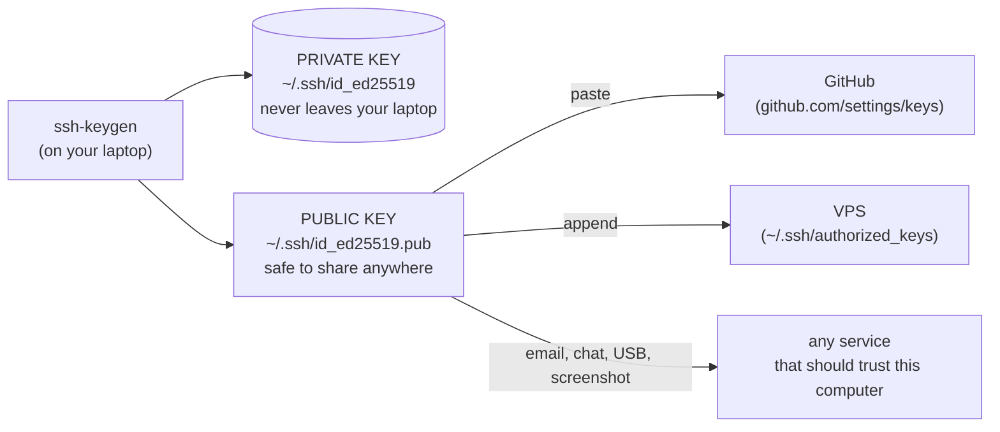
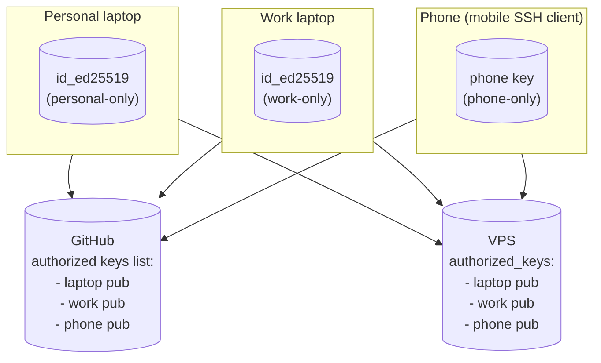

# SSH Keys: Generation, Naming, the Config File, and Multi-Device Workflow

> Everything you need to confidently manage SSH keys across multiple computers, multiple identities, and multiple servers — including the `~/.ssh/config` file format that ties it all together. This how-to centers the parts that aren't obvious from a typical "just run ssh-keygen" tutorial.

> [!NOTE]
> **Last validated: 2026-05.** OpenSSH current (built into Linux/macOS/Windows 10+), 1Password SSH Agent v8+, GitHub key formats current. Bump and re-validate annually per [CLAUDE.md](../CLAUDE.md) standard #5.

## What you'll have at the end

- A clear mental model of asymmetric SSH auth: what the public/private halves do, where each belongs, and why some channels are safe to send the public half over.
- The ability to generate keys with custom names, organize them sensibly in `~/.ssh/`, and authorize them on GitHub + on servers.
- A working `~/.ssh/config` that lets you type `ssh myvps` or `ssh github-work` and have the right key + user + host applied automatically.
- A multi-device story: add a new computer, revoke a lost one, rotate keys, without disturbing the others.
- A multi-account story: separate GitHub identities, separate VPS users, separate everything — all reachable from one machine.
- Cross-platform comfort: Windows + WSL + Linux + macOS all use the same format, but each has minor wrinkles.

## Prerequisites

- A command line (any platform — WSL, macOS Terminal, Linux, PowerShell, Git Bash).
- OpenSSH installed (it's built into all modern OSes — Windows 10+, macOS, every Linux distro).
- ~30 minutes if you're working through this start to finish.

---

## Table of contents

1. [The mental model](#1-the-mental-model)
2. [Generating keys](#2-generating-keys)
3. [Naming conventions](#3-naming-conventions)
4. [The `.ssh` directory across platforms](#4-the-ssh-directory-across-platforms)
5. [The SSH config file](#5-the-ssh-config-file)
6. [`ssh-agent`: caching the unlocked key](#6-ssh-agent-caching-the-unlocked-key)
7. [Multi-device workflow](#7-multi-device-workflow)
8. [Multi-account workflow (two GitHubs, two VPSes, etc.)](#8-multi-account-workflow-two-githubs-two-vpses-etc)
9. [Cross-platform: Windows ↔ WSL ↔ Linux ↔ macOS](#9-cross-platform-windows--wsl--linux--macos)
10. [Agent forwarding (and when not to)](#10-agent-forwarding-and-when-not-to)
11. [Rotation and revocation](#11-rotation-and-revocation)
12. [Troubleshooting](#12-troubleshooting)
13. [Alternatives considered](#13-alternatives-considered)
14. [Quick reference](#14-quick-reference)

---

## 1. The mental model

Asymmetric crypto in 30 seconds: an SSH "key" is actually a **pair** of related files — a **private key** and a **public key**. They're mathematically linked. You can:

- Sign something with the private key; anyone with the public key can verify the signature was made by the holder of the private key.
- Encrypt something with the public key; only the holder of the private key can decrypt it.

For SSH authentication, the server has your **public key** on file (in its `~/.ssh/authorized_keys`). When you connect, the server sends a challenge; your SSH client signs it with the **private key**; the server verifies the signature against the public key it has stored. If the math checks out, you're in.



The asymmetry is the whole magic:

- **The private key is the secret.** If someone gets it, they can impersonate you. Protect it like a password — actually, more carefully, because it's longer-lived than most passwords.
- **The public key isn't a secret.** Email it. Paste it in chat. Put it in a screenshot. Print it on a t-shirt. Nothing about possessing the public key gives anyone the ability to derive the private key. (This is a hard mathematical guarantee, not a "we hope so.")

> [!WARNING]
> **You never copy the private key between computers.** If you want a second device to be able to log in, you generate a *new* keypair on that second device and authorize its public key wherever it needs to go. The private key never travels. See [§7](#7-multi-device-workflow) for the workflow.

### Why people get confused

The mental model gets muddy because:

- Both files are commonly called "the key" (especially "private key" in casual speech).
- The convention `id_ed25519` / `id_ed25519.pub` looks like one file with a `.pub` variant — and that's basically what it is, but the variants are mathematically *paired*, not derived.
- Some tutorials say "copy your SSH key to the server," and the reader assumes that means the private key. It doesn't. It means append the public key to the server's `authorized_keys`.

If you internalize "the private key never moves; the public key goes everywhere it should be trusted," the rest follows.

---

## 2. Generating keys

The canonical command:

```bash
ssh-keygen -t ed25519 -C "your-comment-here"
```

That prompts for a file path (default `~/.ssh/id_ed25519`) and a passphrase. Output: two files — the private key at the path you chose, the public key at the same path with `.pub` appended.

### What every flag means

- `-t ed25519` — **the algorithm.** Use Ed25519. Smaller, faster, more secure than RSA. Supported by every modern SSH server and by GitHub. Don't use RSA in 2026 unless you're forced to (some ancient enterprise SSH server, etc.).
- `-C "..."` — **the comment**. Embedded into the public key. Shows up in GitHub's UI and in `authorized_keys` files. Use it to identify which key is which when you have multiple. Conventional: `email-address`, `username@hostname`, or freeform like `"work laptop 2026"`.
- `-f <path>` — **the output filename.** Defaults to `~/.ssh/id_<algo>`. Override when you want a custom name.
- `-N <passphrase>` — **the passphrase** (non-interactive). Use `-N ""` for no passphrase. **Almost always avoid `-N ""`** — only use it for CI keys (Step 12 of [vps-from-zero](../vps-from-zero/README.md)) that need to be used non-interactively.

### Custom filename

```bash
ssh-keygen -t ed25519 -f ~/.ssh/id_ed25519_work -C "work laptop 2026"
```

You now have:

- `~/.ssh/id_ed25519_work` — private (no extension)
- `~/.ssh/id_ed25519_work.pub` — public

Same format as the default `id_ed25519` keys; just a different name. SSH won't find this automatically — you'll point to it in `~/.ssh/config` (see [§5](#5-the-ssh-config-file)) or load it manually with `ssh-add`.

### About the passphrase

> [!IMPORTANT]
> **Set a passphrase.** Even on your personal laptop. Without one, a stolen laptop = an attacker who can immediately use the key from your `~/.ssh/`. With one, they'd also have to crack the passphrase or extract it from memory — much higher bar.
>
> The passphrase isn't a friction problem because `ssh-agent` caches the unlocked key for the rest of your session ([§6](#6-ssh-agent-caching-the-unlocked-key)). You type it once per WSL session and forget about it.

The only legitimate reason to skip the passphrase: **CI keys** (no human to type it) and **scripts that run unattended** (cron, automation). In those cases the key is sandboxed by other means — a deploy user with no sudo, a service account with limited scope.

### Algorithm choice (deep dive)

| Algorithm | Recommended? | Notes |
|---|---|---|
| **Ed25519** | ✅ Yes | Modern, fast, small (32-byte public, 64-byte private), built into OpenSSH 6.5+ (2014). Default choice. |
| **Ed25519-SK** | ✅ For hardware keys | Variant that lives on a FIDO2/Yubikey hardware token. Use if you're going hardware-token. |
| **ECDSA-P256** | OK | Older curve-based, still secure. Slightly more interop, but Ed25519 has won. |
| **RSA 4096** | Only if forced | Older, larger, slower. Still secure if key size is ≥4096 bits. Required for some old enterprise SSH servers. |
| **RSA 2048** | ❌ No | Too small for new keys in 2026. |
| **DSA** | ❌ Never | Deprecated. Removed from OpenSSH 9.8+. |

Ed25519 unless there's a specific reason. The reason is rarely "I want to."

---

## 3. Naming conventions

OpenSSH treats `~/.ssh/id_<algo>` as a **default key** — it gets tried automatically when connecting. Anything else needs to be referenced explicitly (in `~/.ssh/config` or via `-i <path>` on the command line).

Common naming patterns:

| Pattern | Example | Use it when |
|---|---|---|
| `id_<algo>` | `id_ed25519` | Your one main personal key. ssh-agent + ssh client both find it automatically. |
| `id_<algo>_<purpose>` | `id_ed25519_work`, `id_ed25519_personal` | Multiple identities on the same machine, all using the same algorithm. |
| `<purpose>` (bare) | `vps-deploy`, `github_work`, `aws_admin` | You want descriptive names without the `id_` prefix. Slightly cleaner; needs config to wire up. |
| `<host>_<algo>` | `github_ed25519`, `bitbucket_ed25519` | One key per service. Granular, more management. |

> [!TIP]
> Stick with `id_<algo>_<purpose>` for personal/identity keys. It tells you the algorithm at a glance (helpful when troubleshooting), and the purpose suffix prevents collisions. For service-account or task-specific keys (CI, backup), bare descriptive names (`vps-deploy`, `backup-server`) read better.

### Recommendations

- **One default personal key** at `~/.ssh/id_ed25519` for everything you do as "yourself" — GitHub auth, SSHing into your VPS, dev container forwarding. This is the simplest setup and works for most people.
- **Additional named keys** when you have a legitimate reason to separate (work identity, CI key, backup-server-only key, etc.).
- **Match the comment to the key name and purpose** so you can identify a key in any context (in `authorized_keys`, in GitHub's settings, in `ssh-add -l` output). Comments are free; use them.

### What NOT to do

- Don't have a dozen keys "just in case." More keys = more rotation burden. Add them only when there's a real reason.
- Don't name keys after specific servers if those servers might change (`mybox-2024` becomes stale when you rebuild the box). Name them after **purpose**.
- Don't omit the comment. A key with no comment, surfaced in an `authorized_keys` file you didn't write, is a mystery.

---

## 4. The `.ssh` directory across platforms

### Where it lives

| Platform | Path |
|---|---|
| Linux / macOS / WSL2 (Ubuntu) | `~/.ssh/` — usually `/home/<user>/.ssh/` or `/Users/<user>/.ssh/` |
| Windows (native OpenSSH, PowerShell, Git for Windows) | `C:\Users\<username>\.ssh\` |
| WSL accessing Windows' `.ssh` | `/mnt/c/Users/<windows-username>/.ssh/` |
| Cygwin | `~/.ssh/` mapped to its own home (varies) |

> [!NOTE]
> **The folder is always named `.ssh` — with the leading dot.** Windows preserves the Unix-style hidden-folder convention. Modern Windows OpenSSH (built into Windows 10+) reads from `%USERPROFILE%\.ssh\` (= `C:\Users\<you>\.ssh\`). File Explorer hides folders starting with `.` by default — toggle "Show hidden files" in View options, or just type the path in the address bar.

### What lives in there

```
~/.ssh/
├── id_ed25519              # private key (your main one)
├── id_ed25519.pub          # public key (the one you copy around)
├── id_ed25519_work         # private key (another identity, optional)
├── id_ed25519_work.pub     # public key (matching)
├── config                  # SSH client config (see §5)
├── known_hosts             # fingerprints of servers you've connected to
├── known_hosts.old         # backup; OpenSSH writes this when known_hosts grows
└── authorized_keys         # ← only on a SERVER, not on your laptop
                            #   the keys that are allowed to log in AS you
```

### Permissions — these matter

OpenSSH refuses to use a private key with sloppy permissions. It'll silently fall back to other auth methods, which is its own debugging nightmare ("why won't my key work?" — because the file is `0644` instead of `0600`).

```bash
chmod 700 ~/.ssh                   # directory: only you can list/enter
chmod 600 ~/.ssh/id_*              # private keys + config: only you can read
chmod 644 ~/.ssh/id_*.pub          # public keys: world-readable is fine
chmod 644 ~/.ssh/known_hosts       # also fine to be world-readable
chmod 600 ~/.ssh/authorized_keys   # only on a server; only you can edit
```

On Windows, permissions matter equally. The `ssh-copy-id` / OpenSSH client will warn if `C:\Users\<you>\.ssh\id_ed25519` has loose ACLs (group "Users" can read). The fix on PowerShell:

```powershell
icacls "$env:USERPROFILE\.ssh\id_ed25519" /inheritance:r
icacls "$env:USERPROFILE\.ssh\id_ed25519" /grant:r "$($env:USERNAME):F"
```

Or simpler: copy the key from WSL where the perms are already correct, and Windows OpenSSH usually inherits them.

> [!WARNING]
> If you `cp ~/.ssh/id_ed25519 /mnt/c/Users/joshu/.ssh/` from WSL, double-check the destination perms. The 9p filesystem mount can mangle Unix-style permissions. Run the `icacls` commands above on the Windows side after copying.

---

## 5. The SSH config file

The `~/.ssh/config` file is the place where multi-key, multi-host, multi-user SSH stops being painful. Without it, you'd type:

```bash
ssh -i ~/.ssh/id_ed25519_work -p 2222 -o IdentitiesOnly=yes git@github.com-work
```

every time. With it, you type:

```bash
ssh github-work
```

and the config supplies everything else.

### File location

Same name and same format on every platform. Just the location varies:

- Linux / macOS / WSL: `~/.ssh/config`
- Windows native: `C:\Users\<you>\.ssh\config`

> [!NOTE]
> The **file format is identical** across platforms. The same `config` file works in WSL, Windows OpenSSH, and macOS Terminal without changes — provided the paths inside it (`IdentityFile ~/.ssh/...`) resolve correctly on each. `~` expands to the user's home directory on each OS. If you want one config file used by both WSL and Windows: edit it on the Windows side, then symlink from WSL: `ln -s /mnt/c/Users/joshu/.ssh/config ~/.ssh/config`.

### The format

Plain UTF-8 text. Blocks of `Host <pattern>` followed by indented options. Comments start with `#`.

```
# Comments start with #

Host github.com
    HostName github.com
    User git
    IdentityFile ~/.ssh/id_ed25519
    IdentitiesOnly yes

Host myvps
    HostName 1.2.3.4
    User julian
    IdentityFile ~/.ssh/id_ed25519
    Port 22
```

Rules of the format:

- **Indentation is conventional, not required.** Any whitespace works. Convention is 2 or 4 spaces for the options inside a `Host` block.
- **Option names are case-insensitive.** `HostName`, `hostname`, `HOSTNAME` all work. Convention is PascalCase / camelCase.
- **Values can be quoted** (with double quotes) if they contain spaces. Rarely needed.
- **One option per line.** Multiple options separated by newlines.
- **Order of `Host` blocks matters.** First match wins for most options.

### The most useful directives

| Directive | What it does | Example |
|---|---|---|
| `Host` | Pattern this block applies to | `Host github-work` |
| `HostName` | Actual hostname/IP to connect to | `HostName github.com` |
| `User` | Username on the remote | `User julian` |
| `Port` | Non-default SSH port | `Port 2222` |
| `IdentityFile` | Which private key to use | `IdentityFile ~/.ssh/id_ed25519_work` |
| `IdentitiesOnly` | Only try the IdentityFile (not every loaded key) | `IdentitiesOnly yes` |
| `ProxyJump` | Jump host (SSH through another host) | `ProxyJump bastion` |
| `ForwardAgent` | Forward your ssh-agent to the remote (use sparingly) | `ForwardAgent yes` |
| `ServerAliveInterval` | Keepalive to prevent connection drops | `ServerAliveInterval 60` |
| `StrictHostKeyChecking` | Behavior on unknown host fingerprints | `StrictHostKeyChecking ask` |
| `UserKnownHostsFile` | Override the default `known_hosts` location | `UserKnownHostsFile ~/.ssh/known_hosts.work` |

### `IdentitiesOnly yes` — the most important non-obvious directive

By default, when you connect to a host, your SSH client offers **every key loaded in the agent**, one at a time. If you have 5 keys loaded and the server doesn't immediately accept the first, the client tries the next, and the next. After ~3 wrong attempts, **most servers cut you off** with "Too many authentication failures" — even if your *correct* key was about to be tried.

`IdentitiesOnly yes` tells SSH "only try the `IdentityFile` I specified for this host; don't offer anything else from the agent." This is the only way to reliably use multiple keys for the same hostname (e.g., two GitHub accounts).

> [!IMPORTANT]
> **Set `IdentitiesOnly yes` in every `Host` block where you specify an `IdentityFile`.** Without it, multi-key setups break in confusing ways.

### Pattern matching

The `Host` directive's value is a **pattern**, not necessarily a literal hostname.

| Pattern | Matches |
|---|---|
| `Host github.com` | Exactly `ssh github.com` |
| `Host github-work` | `ssh github-work` — a custom alias (the HostName inside resolves to the real one) |
| `Host *.example.com` | Any subdomain of example.com (`api.example.com`, `db.example.com`, etc.) |
| `Host vps-*` | Anything starting with `vps-` |
| `Host github.com github-work github-personal` | Three hosts share these settings (space-separated) |
| `Host *` | All hosts (used for repo-wide defaults) |

First match wins. Put **specific patterns before broad ones**:

```
# specific first
Host github-work
    HostName github.com
    User git
    IdentityFile ~/.ssh/id_ed25519_work
    IdentitiesOnly yes

# then broad fallback
Host *
    ServerAliveInterval 60
    AddKeysToAgent yes
```

Some options *merge* across multiple matching blocks rather than first-match-wins. `IdentityFile` is one — multiple `IdentityFile` directives across matching blocks accumulate. Most other options follow first-match-wins. The OpenSSH docs are the source of truth: `man ssh_config`.

### Real-world config: one personal key

The simplest useful config:

```
# Default for everything
Host *
    AddKeysToAgent yes
    IdentitiesOnly yes
    IdentityFile ~/.ssh/id_ed25519
    ServerAliveInterval 60

# Personal VPS
Host myvps
    HostName 198.51.100.42
    User julian

# Same VPS, as the deploy user (for debugging CI issues)
Host myvps-deploy
    HostName 198.51.100.42
    User deploy
    IdentityFile ~/.ssh/vps-deploy
```

Now `ssh myvps` works, and `ssh myvps-deploy` uses a different key + user.

### Real-world config: two GitHub accounts

```
# Personal GitHub
Host github-personal
    HostName github.com
    User git
    IdentityFile ~/.ssh/id_ed25519_personal
    IdentitiesOnly yes

# Work GitHub
Host github-work
    HostName github.com
    User git
    IdentityFile ~/.ssh/id_ed25519_work
    IdentitiesOnly yes
```

Then in your work repos, set the remote to use the work alias:

```bash
git remote set-url origin git@github-work:work-org/work-repo.git
```

Note `github-work:` instead of `github.com:` — that's the SSH host alias. The config resolves it to `github.com` with the right key + user.

For personal repos: `git@github-personal:joshuawjulian/howtos.git` (which is the same pattern we used to fix the `github.com-joshuawjulian` typo earlier).

### Real-world config: jump host

You SSH through a bastion to reach a private VPS:

```
Host bastion
    HostName bastion.example.com
    User joshua
    IdentityFile ~/.ssh/id_ed25519

Host private-vps
    HostName 10.0.0.5            # private IP, not reachable from internet
    User julian
    IdentityFile ~/.ssh/id_ed25519
    ProxyJump bastion             # SSH through bastion to reach this
```

`ssh private-vps` now SSHes to the bastion, then from the bastion to `10.0.0.5`, transparently.

### Verifying what your config does for a given host

```bash
ssh -G myvps    # print the effective config for "myvps" without connecting
```

Output is every option that would be applied, with values. Useful for "why is my config not doing what I think?"

---

## 6. `ssh-agent`: caching the unlocked key

The passphrase protects your private key at rest. But typing it every time you `git push` would be intolerable. `ssh-agent` is a small daemon that holds the **unlocked** key in memory for the duration of your session, and the SSH client asks the agent to perform signing operations.

### The basic flow

1. Start `ssh-agent` (usually automatic).
2. Add a key with `ssh-add ~/.ssh/id_ed25519`. It prompts for the passphrase, decrypts the key, holds it in memory.
3. Every subsequent SSH operation in that session uses the agent — no more passphrase prompts.
4. When the agent exits (logout, reboot), the unlocked key is gone. Next session, you'll be prompted again.

```bash
ssh-add -l        # list keys currently loaded (by fingerprint + comment)
ssh-add -L        # show the actual public keys loaded
ssh-add -d ~/.ssh/id_ed25519    # remove one key from the agent
ssh-add -D        # remove ALL keys from the agent
```

### Persistence — making the agent survive terminal close

By default, every new terminal starts its own `ssh-agent`. You'd type the passphrase per terminal. The fix: a wrapper that finds-or-starts a single shared agent across all your shells.

**On Linux / WSL: `keychain`**

```bash
sudo apt install keychain
```

Add to `~/.bashrc`:

```bash
eval "$(keychain --eval --quiet id_ed25519)"
```

Now: open a terminal, type the passphrase once when prompted, every subsequent terminal in that session reuses the same agent. Survives terminal close/reopen. Only dies on system reboot or WSL shutdown.

**On Windows native: the OpenSSH agent service**

```powershell
# As Administrator, once:
Get-Service ssh-agent | Set-Service -StartupType Automatic
Start-Service ssh-agent

# Then per-user:
ssh-add $env:USERPROFILE\.ssh\id_ed25519
```

The agent runs as a Windows service and survives logout. Loaded keys persist until you `ssh-add -d` or reboot.

**On macOS: built-in**

macOS pre-installs an SSH agent integrated with the Keychain. Just `ssh-add --apple-use-keychain ~/.ssh/id_ed25519` once and the passphrase is stored in Keychain. Subsequent sessions unlock the key automatically.

**Best option (cross-platform, biometric): 1Password SSH Agent**

If you already use 1Password, its built-in SSH agent is genuinely the slickest path. Store the key in 1Password instead of on disk. The agent socket is at `~/.1password/agent.sock` (Linux) or via a special URL on macOS/Windows. Point `SSH_AUTH_SOCK` at it. Every SSH operation prompts for biometric (Touch ID / Windows Hello) or vault unlock. Per-use auth, no `ssh-add` ceremony, syncs across all your 1Password-enabled devices.

Setup once in 1Password settings → Developer → "Use the SSH agent." 1Password generates and stores keys; you never see the private key file because there isn't one on disk.

### `AddKeysToAgent yes` in config

A nice quality-of-life flag:

```
Host *
    AddKeysToAgent yes
```

The first time you use a key in a session, SSH adds it to the agent automatically (prompting for the passphrase). No more manual `ssh-add` step.

---

## 7. Multi-device workflow

You have a personal laptop with the original setup. You get a work laptop. You want it to be able to push to GitHub and SSH into your VPS without compromising any keys.

### The principle

**Generate a brand-new keypair on the new device.** Never copy the private key from one device to another. Each device gets its own private key; only the *public keys* get authorized in the same places.



If you lose the work laptop, you revoke *only* its public key. Other devices are unaffected because each was already independently authorized.

### Step-by-step

**1. On the new device, generate a keypair:**

```bash
ssh-keygen -t ed25519 -f ~/.ssh/id_ed25519 -C "work laptop 2026"
```

(Use a distinctive comment so you can identify this key in `authorized_keys` / GitHub UI.)

**2. Copy the public key text:**

```bash
cat ~/.ssh/id_ed25519.pub
```

One line starting with `ssh-ed25519 AAAA...`. That's the public key. Copy it.

**3. Authorize the public key on GitHub:**

Go to [github.com/settings/keys](https://github.com/settings/keys) → "New SSH key" → paste. Title it `work laptop` (matches the comment from Step 1 — same name everywhere is good).

You can do this from any browser, including your personal laptop. Public keys aren't sensitive; the transport channel doesn't matter.

**4. Authorize the public key on the VPS:**

Two options:

```bash
# Option A: from the new device, if you can already SSH in some other way
ssh-copy-id julian@<vps-ip>

# Option B: from any device that can already SSH in
ssh myvps
echo "ssh-ed25519 AAAA... work laptop 2026" >> ~/.ssh/authorized_keys
```

`ssh-copy-id` is the cleaner option — it appends the public key with correct permissions. Use it when the new device can authenticate via password fallback or another existing key.

**5. Test:**

```bash
# from the new device
ssh -T git@github.com   # should say "Hi joshuawjulian!"
ssh myvps               # should log in
```

Done. The work laptop has its own key, its own passphrase, and is independently authorized.

### Why this is safe

Every step above involved only the **public key**. The private key never left the work laptop. There is no "compromise vector" — the public key is meant to be widely distributed.

If a paranoid friend asks "but what if someone intercepted the public key in transit?" — even if they did, the worst they can do is also add it to their own authorized systems, where it'd give them no advantage (they'd still need *your* private key to authenticate). Or they could swap it with their own public key, which would lock you out — and you'd notice immediately on the first failed login.

For most personal use, this isn't worth worrying about. For higher-stakes setups, verify the fingerprint on both ends:

```bash
ssh-keygen -lf ~/.ssh/id_ed25519.pub
# 256 SHA256:abc123def456... work laptop 2026 (ED25519)
```

That fingerprint is short enough to read over a phone call.

---

## 8. Multi-account workflow (two GitHubs, two VPSes, etc.)

Same machine, multiple identities. Common scenarios:

- **Two GitHub accounts** — personal and work.
- **Multiple VPSes** with different users.
- **A few different SSH servers** each preferring different keys.

The pattern: **one key per identity** + **`~/.ssh/config` host aliases** + **`IdentitiesOnly yes`**.

### Two GitHub accounts

**Generate two keys:**

```bash
ssh-keygen -t ed25519 -f ~/.ssh/id_ed25519_personal -C "personal joshuawjulian@gmail.com"
ssh-keygen -t ed25519 -f ~/.ssh/id_ed25519_work     -C "work joshua@employer.com"
```

**Add each to the respective GitHub account:**

- Log in to personal GitHub → settings/keys → paste `~/.ssh/id_ed25519_personal.pub`.
- Log in to work GitHub → settings/keys → paste `~/.ssh/id_ed25519_work.pub`.

**Configure `~/.ssh/config`:**

```
Host github-personal
    HostName github.com
    User git
    IdentityFile ~/.ssh/id_ed25519_personal
    IdentitiesOnly yes

Host github-work
    HostName github.com
    User git
    IdentityFile ~/.ssh/id_ed25519_work
    IdentitiesOnly yes
```

**Use the aliases in git remotes:**

```bash
# personal repo
git clone git@github-personal:joshuawjulian/howtos.git

# work repo
git clone git@github-work:my-employer/secret-project.git

# fix an existing remote
git remote set-url origin git@github-work:my-employer/secret-project.git
```

The `github-personal` and `github-work` in the URL are SSH config aliases. SSH resolves them, applies the right `IdentityFile`, then connects to the actual `github.com`. GitHub doesn't know about the alias; it just sees the right key for the right account.

> [!CAUTION]
> **The `Host` alias replaces `github.com` in the SSH URL, but only for SSH operations.** If you accidentally use the literal `git@github.com:...` URL with no alias, git will use the default key and probably push to the wrong account. Either always use the alias, or set up `git config user.email` per-repo so commits at least have the right author even if the remote is off.

### Two GitHubs + same VPS

Combine the patterns. Your VPS has only one user (`julian`) and accepts your one main key. Your two GitHubs each get a distinct work/personal key. All in the same config:

```
Host github-personal
    HostName github.com
    User git
    IdentityFile ~/.ssh/id_ed25519_personal
    IdentitiesOnly yes

Host github-work
    HostName github.com
    User git
    IdentityFile ~/.ssh/id_ed25519_work
    IdentitiesOnly yes

Host myvps
    HostName 198.51.100.42
    User julian
    IdentityFile ~/.ssh/id_ed25519_personal
    IdentitiesOnly yes
```

(Or use a separate VPS key — `id_ed25519_vps` — if you want even stricter separation.)

---

## 9. Cross-platform: Windows ↔ WSL ↔ Linux ↔ macOS

The **file format** of keys and the `config` file is identical on every platform. OpenSSH on Linux, OpenSSH on Windows (built into Windows 10+), and macOS's built-in SSH all read the same files in the same format.

The **wrinkles** are about:

- **Where the files live** on each platform.
- **Which SSH client/agent is in use** when you run `ssh` from different shells.
- **How to share a key between Windows and WSL** (one file, two consumers).

### Path summary

| Tool | Reads keys from |
|---|---|
| WSL Ubuntu bash | `~/.ssh/` in WSL (`/home/<user>/.ssh/`) |
| WSL accessing Windows | `/mnt/c/Users/<windows-user>/.ssh/` |
| Windows PowerShell + native OpenSSH | `%USERPROFILE%\.ssh\` = `C:\Users\<user>\.ssh\` |
| Git Bash | `~/.ssh/` (resolves to `C:\Users\<user>\.ssh\`) |
| VS Code Remote-SSH | The .ssh of whichever side is running (Windows side if local) |
| VS Code Dev Containers | Forwards the host's ssh-agent into the container automatically |
| PuTTY | Its own `.ppk` format, separate location (Documents folder typically) |

### Sharing one key between WSL and Windows

Two strategies:

**A. Keep the key in WSL; let Windows tools use it via the Windows OpenSSH agent.**

1. Generate in WSL.
2. Copy to Windows .ssh: `cp ~/.ssh/id_ed25519 ~/.ssh/id_ed25519.pub /mnt/c/Users/<you>/.ssh/`.
3. Start the Windows OpenSSH agent service (PowerShell as admin: `Start-Service ssh-agent; Set-Service ssh-agent -StartupType Automatic`).
4. From PowerShell: `ssh-add $env:USERPROFILE\.ssh\id_ed25519`.

Now both WSL bash and PowerShell can SSH using the same key.

**B. Keep the key in Windows; share into WSL via a symlink.**

```bash
# in WSL
mkdir -p ~/.ssh
ln -s /mnt/c/Users/<you>/.ssh/id_ed25519 ~/.ssh/id_ed25519
ln -s /mnt/c/Users/<you>/.ssh/id_ed25519.pub ~/.ssh/id_ed25519.pub
ln -s /mnt/c/Users/<you>/.ssh/config ~/.ssh/config
```

Wrinkle: the 9p filesystem mount can mangle Unix permissions. SSH may refuse to use the symlinked key because the perms look loose. Fix: copy instead of symlink, then `chmod 600` in WSL.

**Pragmatic recommendation:** generate and live in WSL. Copy to Windows when you need Windows-native tools. The WSL side is where most dev work happens; the Windows side is a backup + occasional tool consumer.

### Line endings

> [!IMPORTANT]
> **SSH config files and authorized_keys files must use LF line endings, not CRLF.** Windows tools (Notepad, some editors) can save with CRLF, which breaks SSH. Use VS Code or any editor that respects file-specific line endings. Check with `file ~/.ssh/config` — should say "ASCII text" or "UTF-8 text," not "ASCII text, with CRLF line terminators."

If your `~/.ssh/config` somehow gets CRLF endings (most often from a Windows-side edit that synced to WSL), convert:

```bash
dos2unix ~/.ssh/config
# or
sed -i 's/\r$//' ~/.ssh/config
```

---

## 10. Agent forwarding (and when not to)

**Agent forwarding** (`ForwardAgent yes`) lets a remote machine use *your* SSH agent to authenticate to *other* hosts.

The use case: you SSH from your laptop to a server, and from that server you need to `git pull` from a private GitHub repo. Without agent forwarding, the server would need its own SSH key authorized on GitHub. With agent forwarding, the server's `ssh git@github.com` reaches back through the open SSH connection and asks *your laptop's agent* to sign the challenge. Your laptop signs; the server forwards the signature; GitHub accepts. The server never sees the key.

### When it's safe

- **Dev Containers.** VS Code uses agent forwarding under the hood to give containers access to your keys without putting the keys inside the container. The container is trusted; the agent forwarding is fine.
- **Your own VPSes and trusted infrastructure.** A box you control.
- **Jump hosts (bastions).** When you `ProxyJump` through a bastion, the bastion needs to be able to use your keys to log into the destination. `ProxyJump` is actually a safer pattern than `ForwardAgent` here — it tunnels the connection without exposing the agent.

### When it's NOT safe

- **Shared servers.** If you forward your agent to a server, anyone with root on that server (or who can hijack your shell session) can use your agent to authenticate to *anywhere your keys work* — your VPS, your GitHub, your bank if you used keys there. The agent socket is a delegation; anyone with access to the socket has access to the key.
- **Untrusted hosts.** Don't agent-forward to a server you don't control.

> [!CAUTION]
> **Default to `ForwardAgent no`.** Enable it only per-host where you've decided the host is trusted. Setting `ForwardAgent yes` in a `Host *` block is a footgun.

### How to enable per-host

```
Host my-trusted-server
    HostName trusted.example.com
    ForwardAgent yes
```

### How to check what's being forwarded inside the remote session

```bash
ssh-add -L     # if this lists keys, your agent is forwarded
echo $SSH_AUTH_SOCK    # if set, agent is available
```

### `ProxyJump` is usually better than `ForwardAgent`

For jump-host scenarios, `ProxyJump` (or its older equivalent, `ProxyCommand`) tunnels the connection without delegating your agent:

```
Host private-server
    HostName 10.0.0.5
    ProxyJump bastion
```

`ssh private-server` now connects via the bastion **without exposing your agent to the bastion**. The bastion is just routing TCP; your laptop authenticates directly to `private-server` over that tunnel. Safer than agent forwarding to the bastion.

---

## 11. Rotation and revocation

### When to rotate

- A device is lost or stolen.
- You suspect a key has been compromised (laptop infected, backup leaked, etc.).
- Periodic hygiene — every 6-12 months for personal keys, every 30-90 days for service/CI keys in stricter setups.
- Before/after major life events (job change, device replacement).

### The "add new, verify, remove old" pattern

For zero-downtime rotation:

1. **Generate a new keypair on the device.**
   ```bash
   ssh-keygen -t ed25519 -f ~/.ssh/id_ed25519_new -C "rotation 2026-05"
   ```

2. **Add the NEW public key everywhere the old one was authorized.**
   - GitHub: settings/keys → add new (don't remove old yet).
   - VPS: append the new public key to `authorized_keys` (don't remove old yet).

3. **Update your ssh-agent / config to use the new key.**
   ```bash
   mv ~/.ssh/id_ed25519 ~/.ssh/id_ed25519_old
   mv ~/.ssh/id_ed25519_new ~/.ssh/id_ed25519
   mv ~/.ssh/id_ed25519_new.pub ~/.ssh/id_ed25519.pub
   ssh-add ~/.ssh/id_ed25519
   ```

4. **Verify the new key works.**
   - `ssh -T git@github.com` → "Hi joshuawjulian!"
   - `ssh myvps` → logs in
   - Push to a repo.
   - Do a real deploy, etc.

5. **Once you've verified everything works on the new key, remove the old key's public half from each authorized location.**
   - GitHub: delete the old entry.
   - VPS: edit `~/.ssh/authorized_keys`, remove the old line.

6. **Delete the old private key from your laptop.**
   ```bash
   shred -u ~/.ssh/id_ed25519_old        # secure delete on Linux
   # or just rm if you're not paranoid about disk forensics
   ```

The pattern means you're never in a state where *no* key works. Old key works until new key is verified.

### Revoking a specific device

You lost the work laptop. The personal one is fine. Revoke just the work key:

- **GitHub:** [settings/keys](https://github.com/settings/keys) → find the entry with the "work laptop 2026" comment → delete.
- **VPS:** `ssh myvps`, edit `~/.ssh/authorized_keys`, delete the line ending with `work laptop 2026`.
- **Any other service:** find the work key in its authorized list, remove.

Other devices are unaffected. This is the whole point of per-device keys.

### Mass revocation (something is wrong, panic)

Suspect your laptop is compromised? Don't take chances:

1. From a known-good device (or your phone via the GitHub mobile app + your VPS via mobile SSH client):
2. Revoke ALL keys on GitHub: settings/keys → delete every entry.
3. SSH into VPS (from the known-good device): `> ~/.ssh/authorized_keys` (truncate it).
4. Add a fresh key from the known-good device.
5. Investigate / wipe / replace the compromised device.

The reason per-device keys are a good baseline: you can revoke a subset surgically. If you'd shared one key across three devices, this would be all-or-nothing.

---

## 12. Troubleshooting

### `Permission denied (publickey)` when SSHing somewhere

Walk through these in order:

1. **The key file exists and has the right permissions.**
   ```bash
   ls -la ~/.ssh/id_ed25519
   # should be -rw------- (0600)
   chmod 600 ~/.ssh/id_ed25519    # fix if needed
   chmod 700 ~/.ssh                # fix dir too
   ```

2. **The key is in the agent (or specified explicitly).**
   ```bash
   ssh-add -l    # is the key listed?
   # if not:
   ssh-add ~/.ssh/id_ed25519
   ```

3. **The right public key is in the server's `authorized_keys`.**
   ```bash
   # locally:
   cat ~/.ssh/id_ed25519.pub
   # on the server:
   cat ~/.ssh/authorized_keys
   # compare — your public key should appear verbatim
   ```

4. **The server's `sshd_config` allows key auth.**
   ```bash
   sudo grep -E '^(PubkeyAuthentication|PasswordAuthentication)' /etc/ssh/sshd_config
   # PubkeyAuthentication should be yes
   ```

5. **The config is pointing at the right key.**
   ```bash
   ssh -v <host>     # verbose; shows which key it's trying
   ssh -G <host>     # prints effective config
   ```

### "Too many authentication failures"

The agent is offering more keys than the server allows attempts for. Fix: `IdentitiesOnly yes` in the relevant `Host` block, plus explicit `IdentityFile`.

```
Host myvps
    HostName 1.2.3.4
    User julian
    IdentityFile ~/.ssh/id_ed25519
    IdentitiesOnly yes      # ← the fix
```

### `ssh-add -l` shows "The agent has no identities"

No keys loaded. Either:

- Agent isn't running. `eval $(ssh-agent)` to start one (one-off), or set up persistent agent via [§6](#6-ssh-agent-caching-the-unlocked-key).
- Agent is running but keys haven't been added: `ssh-add ~/.ssh/id_ed25519`.

### "Bad permissions" / "It is required that your private key files are NOT accessible by others"

Exactly what it says. Fix:

```bash
chmod 700 ~/.ssh
chmod 600 ~/.ssh/id_ed25519
chmod 644 ~/.ssh/id_ed25519.pub
```

On Windows, use `icacls`:

```powershell
icacls "$env:USERPROFILE\.ssh\id_ed25519" /inheritance:r /grant:r "$($env:USERNAME):F"
```

### "Could not resolve hostname github.com-joshuawjulian" or similar

You used a custom Host alias in a git URL but the corresponding `Host` block doesn't exist (or has a typo). Check:

```bash
grep -A 5 "github.com-joshuawjulian" ~/.ssh/config
```

If the block isn't there, add it. If it is but the alias name differs, fix the mismatch.

### "Host key verification failed"

The server's host key changed (or you're connecting to a different machine at the same address). If you trust this is legit (you rebuilt the VPS, IP got reassigned, etc.):

```bash
ssh-keygen -R <hostname>      # remove the old fingerprint from known_hosts
ssh <hostname>                 # accept the new fingerprint
```

If you DON'T trust it, you're potentially being MITM'd. Stop, verify by some other channel before continuing.

### Wrong identity used for a `git push`

Symptom: you push to a personal repo but GitHub says "permission denied" because it's offering the work key.

Causes:
- Remote URL uses the bare `github.com`, not your alias.
- Your `~/.ssh/config` doesn't have `IdentitiesOnly yes`.
- The agent has both keys loaded; the work key got offered first.

Fix:
- Update remote URL to use the alias: `git remote set-url origin git@github-personal:user/repo.git`.
- Add `IdentitiesOnly yes` to the relevant `Host` blocks.

---

## 13. Alternatives considered

### Key storage / agent

**OpenSSH on-disk keys + `keychain`** (this guide's default)
- Pros: free, works everywhere, no extra dependencies.
- Cons: passphrase-protected file on disk; if laptop disk is exfiltrated, the attacker can brute-force the passphrase offline.

**1Password SSH Agent**
- Pros: biometric auth per use, syncs across devices, key never exists as a plaintext file. Best UX.
- Cons: requires 1Password subscription. Vendor lock-in if you ever leave.
- *When to use:* You already pay for 1Password. The UX improvement is real and worth it.

**Hardware token (Yubikey, similar) with FIDO2**
- Pros: private key never exists in software; must be physically present to authenticate; even a fully-compromised laptop can't be used to authenticate without the hardware.
- Cons: $60-$120 per token; you need to carry it; backup token to avoid lockout if lost.
- *When to use:* high-stakes accounts (root on production servers, cryptocurrency, etc.). Overkill for personal hobby projects.

**SSH certificates (vs raw keys)**
- Pros: short-lived (auto-expiring); central CA manages who can access what; revocation is automatic by expiry.
- Cons: requires a CA infrastructure; only worth it for organizations / teams.
- *When to use:* you're managing access for an organization. Skip for personal use.

**Tailscale SSH (no keys at all)**
- Pros: replaces SSH key management with Tailscale identity (Google/GitHub/email auth + device approval). Drop-in replacement for SSH on private networks.
- Cons: requires Tailscale on every device; vendor dependency; less universal than SSH.
- *When to use:* if you've already adopted Tailscale, it's genuinely nice. Otherwise the overhead isn't worth replacing SSH.

### Algorithms

**Ed25519** — the default for everything new. See [§2](#2-generating-keys).

**RSA 4096** — reconsider only if interoperating with old/embedded SSH servers that don't support Ed25519.

**ECDSA** — was popular pre-Ed25519; still secure but Ed25519 has won the mindshare battle.

**DSA** — never. Removed from OpenSSH.

### Config approach

**`~/.ssh/config`** (this guide) — declarative, file-based, portable.

**Command-line flags every time** — `ssh -i ~/.ssh/key -p 2222 user@host` — works but doesn't scale beyond a couple of hosts. Use only for one-offs.

**Tools that wrap SSH** (e.g., `assh`, `pdsh`) — solve specific multi-host problems. Skip until you have the specific problem they solve.

---

## 14. Quick reference

### Generate a key

```bash
# default (overwrites id_ed25519 if it exists)
ssh-keygen -t ed25519 -C "comment"

# custom name
ssh-keygen -t ed25519 -f ~/.ssh/id_ed25519_<purpose> -C "comment"

# no passphrase (for CI / automation only)
ssh-keygen -t ed25519 -f ~/.ssh/<name> -N "" -C "comment"
```

### Inspect a key

```bash
cat ~/.ssh/id_ed25519.pub                    # the public key (one line)
ssh-keygen -lf ~/.ssh/id_ed25519.pub         # fingerprint
ssh-keygen -y -f ~/.ssh/id_ed25519            # derive public from private (if .pub is missing)
```

### Manage the agent

```bash
ssh-add -l                                   # list loaded keys
ssh-add -L                                   # list loaded public keys (full text)
ssh-add ~/.ssh/id_ed25519                    # add a key (prompts for passphrase)
ssh-add -d ~/.ssh/id_ed25519                 # remove one key
ssh-add -D                                   # remove all keys
```

### Authorize a key on a server

```bash
# Easiest: ssh-copy-id (handles perms + existing file)
ssh-copy-id user@host

# Manual append
cat ~/.ssh/id_ed25519.pub | ssh user@host 'cat >> ~/.ssh/authorized_keys'

# Make sure perms are right on the server
ssh user@host 'chmod 700 ~/.ssh; chmod 600 ~/.ssh/authorized_keys'
```

### Authorize a key on GitHub

```bash
# via the gh CLI:
gh ssh-key add ~/.ssh/id_ed25519.pub --title "my laptop"

# or via web: github.com/settings/keys → New SSH key → paste
```

### Useful config blocks

```
# default for all hosts
Host *
    AddKeysToAgent yes
    IdentitiesOnly yes
    ServerAliveInterval 60

# personal GitHub
Host github-personal
    HostName github.com
    User git
    IdentityFile ~/.ssh/id_ed25519_personal
    IdentitiesOnly yes

# work GitHub
Host github-work
    HostName github.com
    User git
    IdentityFile ~/.ssh/id_ed25519_work
    IdentitiesOnly yes

# your VPS as admin
Host myvps
    HostName <ip>
    User <username>
    IdentityFile ~/.ssh/id_ed25519
    IdentitiesOnly yes

# same VPS as deploy (CI debugging)
Host myvps-deploy
    HostName <ip>
    User deploy
    IdentityFile ~/.ssh/vps-deploy
    IdentitiesOnly yes

# private server behind a bastion
Host private-server
    HostName 10.0.0.5
    User julian
    ProxyJump bastion
    IdentityFile ~/.ssh/id_ed25519
    IdentitiesOnly yes

Host bastion
    HostName bastion.example.com
    User joshua
    IdentityFile ~/.ssh/id_ed25519
    IdentitiesOnly yes
```

### Debug a connection

```bash
ssh -G <host>          # effective config without connecting
ssh -v <host>          # verbose connection
ssh -vv <host>         # very verbose
ssh -vvv <host>        # painfully verbose; useful when nothing else helps
```

### Permission cheat sheet

```bash
chmod 700 ~/.ssh
chmod 600 ~/.ssh/id_*           # private keys + config
chmod 644 ~/.ssh/id_*.pub       # public keys
chmod 644 ~/.ssh/known_hosts
chmod 600 ~/.ssh/authorized_keys
```

### What lives where

| File | Purpose | Permissions |
|---|---|---|
| `~/.ssh/id_ed25519` | Private key | `0600` (rw owner only) |
| `~/.ssh/id_ed25519.pub` | Public key | `0644` (world-readable OK) |
| `~/.ssh/config` | Client config (host aliases, identities) | `0600` |
| `~/.ssh/known_hosts` | Server fingerprints you've accepted | `0644` |
| `~/.ssh/authorized_keys` | (Server-side) public keys allowed to log in | `0600` |
